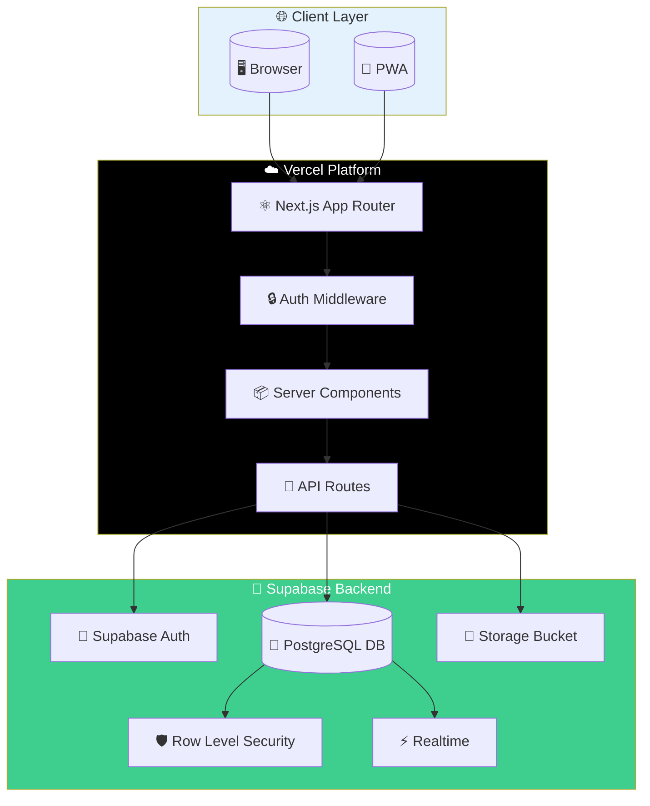
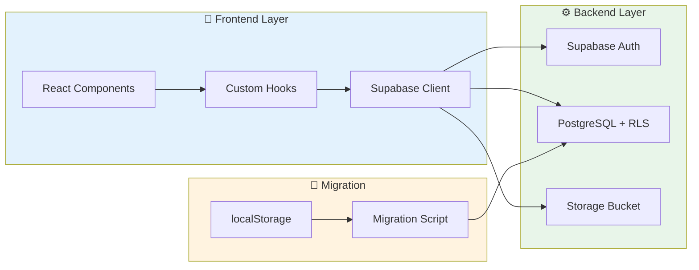
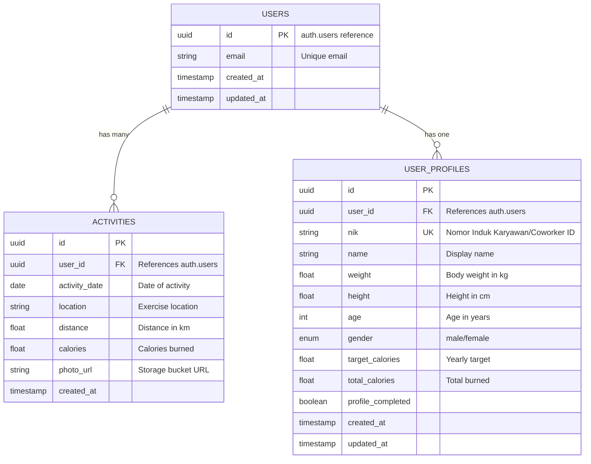
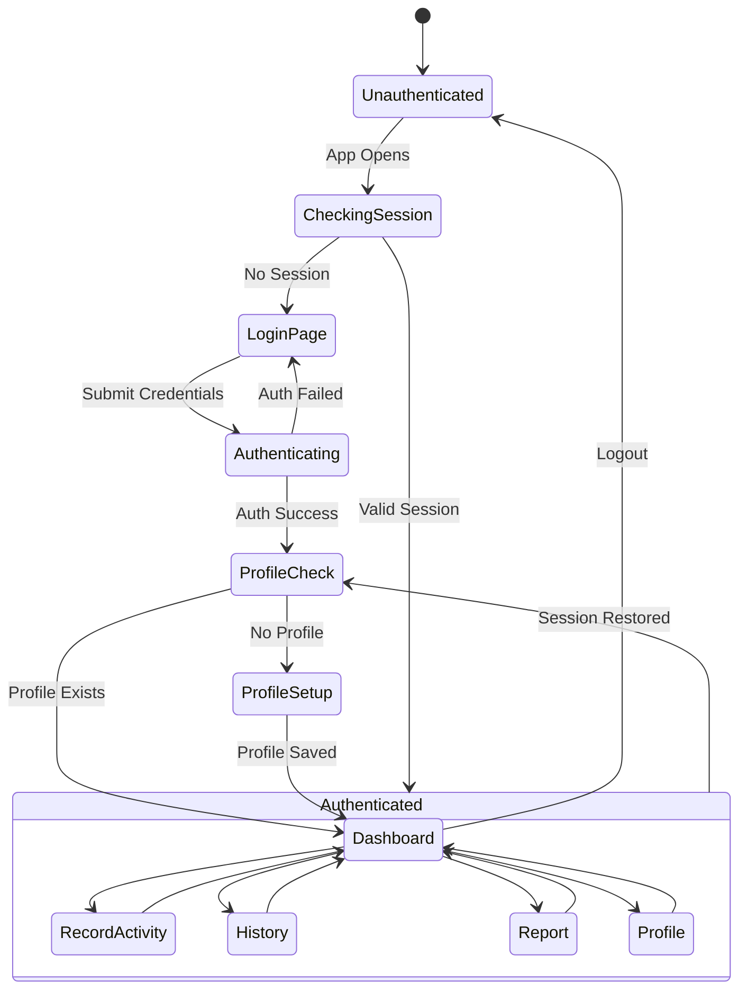
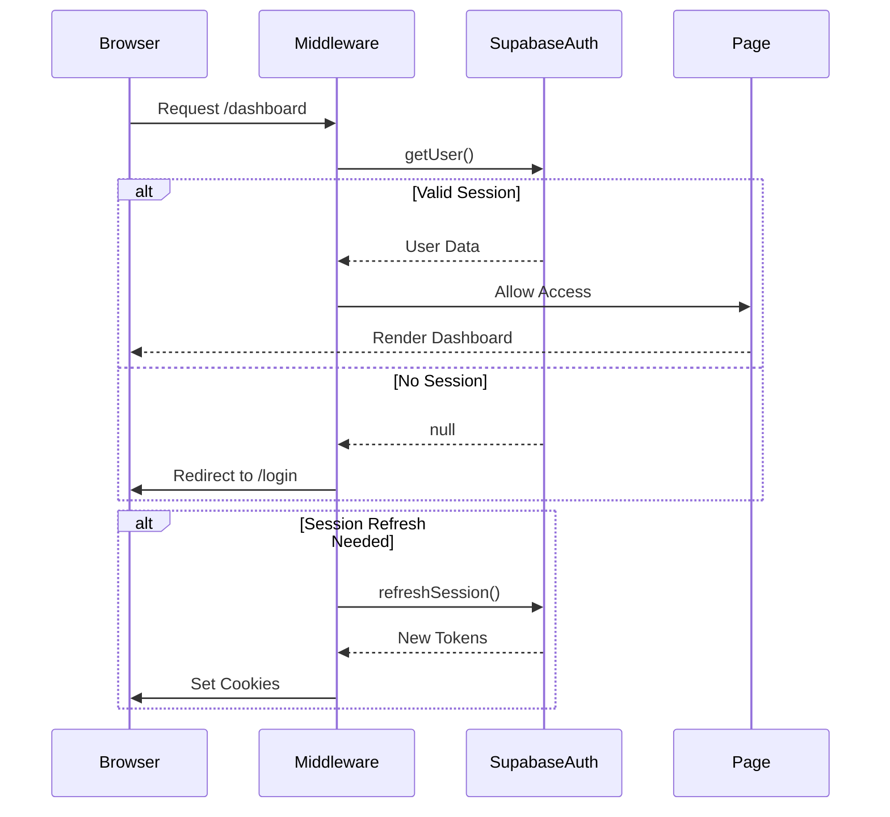
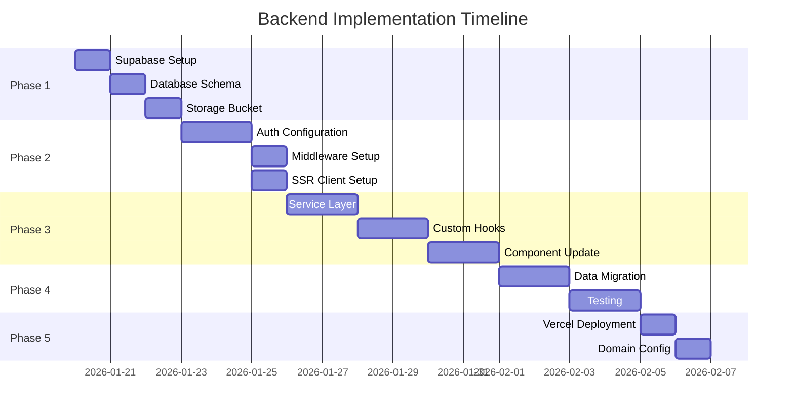
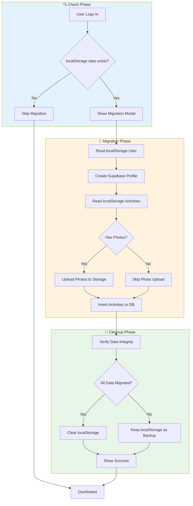
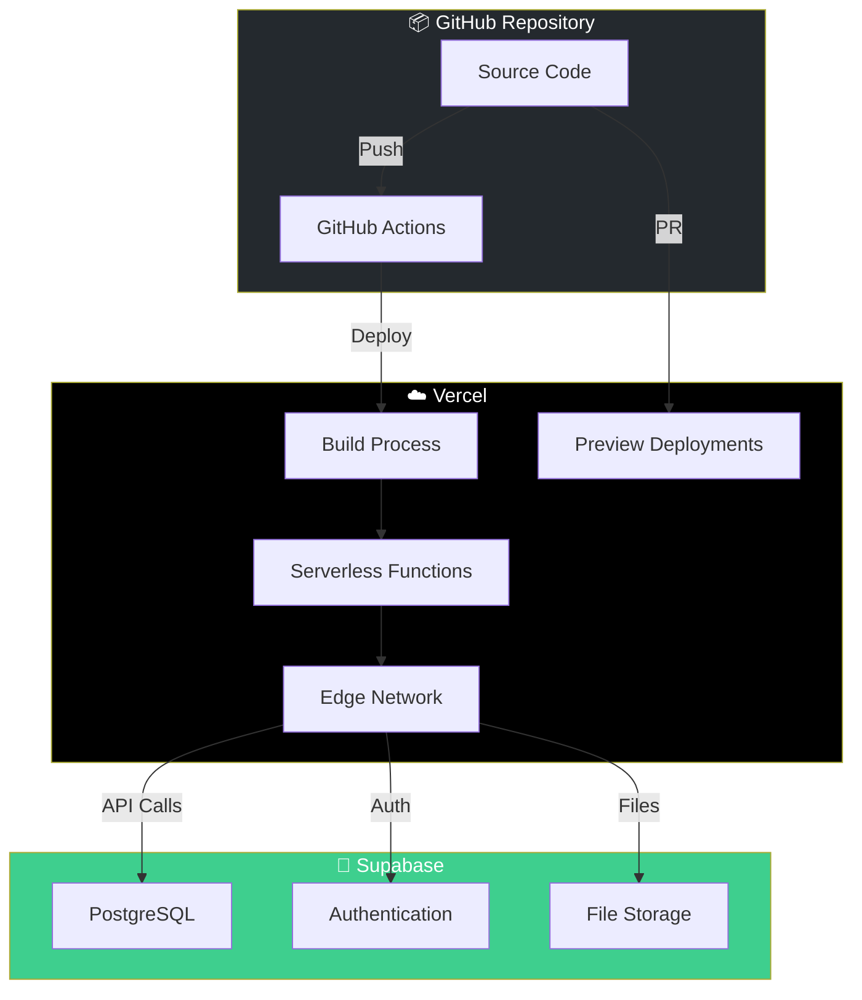
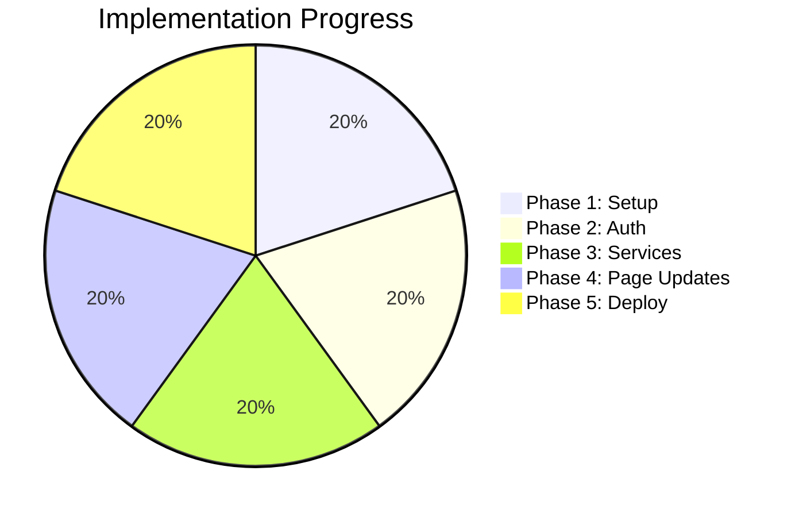

# 🚀 Backend Implementation Plan - ITDigital Wellbeing Monitor

> **Komprehensif Backend Integration dengan Supabase & Vercel Deployment**  
> Target: Migrasi dari localStorage ke cloud-based backend dengan real-time sync

---

## 📋 Executive Summary

Dokumen ini menjelaskan implementasi backend untuk aplikasi **ITDigital Wellbeing Monitor**. Backend telah berhasil diimplementasikan menggunakan **Supabase** sebagai Backend-as-a-Service (BaaS) dan di-deploy ke **Vercel** untuk server-side rendering capabilities.

> [!NOTE]
> **Status: COMPLETED ✅** - Semua fase implementasi sudah selesai.

### Current State (Completed)
- ✅ Frontend: Next.js 16 dengan App Router + SSR
- ✅ Database: Supabase PostgreSQL dengan RLS
- ✅ Auth: Supabase Authentication (NIK/Email + Password)
- ✅ Storage: Supabase Storage (activity photos + avatars)
- ✅ Hosting: Vercel (production deployment)
- ✅ Architecture: Hooks + Services Layer

---

## 🏗️ Architecture Overview

### System Architecture Diagram



### Data Flow Architecture



---

## 📊 Database Schema Design

### Entity Relationship Diagram



### SQL Migration Schema

```sql
-- ============================================================
-- MIGRATION: Create user profiles and activities tables
-- ============================================================

-- Enable UUID extension
CREATE EXTENSION IF NOT EXISTS "uuid-ossp";

-- User Profiles Table
CREATE TABLE public.user_profiles (
    id UUID PRIMARY KEY DEFAULT uuid_generate_v4(),
    user_id UUID NOT NULL REFERENCES auth.users(id) ON DELETE CASCADE,
    nik TEXT UNIQUE,  -- Nomor Induk Karyawan / Coworker ID
    name TEXT NOT NULL,
    weight DECIMAL(5,2) NOT NULL CHECK (weight > 0 AND weight < 500),
    height DECIMAL(5,2) NOT NULL CHECK (height > 0 AND height < 300),
    age INTEGER NOT NULL CHECK (age > 0 AND age < 150),
    gender TEXT NOT NULL CHECK (gender IN ('male', 'female')),
    target_calories DECIMAL(10,2) NOT NULL DEFAULT 0,
    total_calories DECIMAL(10,2) NOT NULL DEFAULT 0,
    profile_completed BOOLEAN NOT NULL DEFAULT false,
    created_at TIMESTAMPTZ NOT NULL DEFAULT NOW(),
    updated_at TIMESTAMPTZ NOT NULL DEFAULT NOW(),
    
    CONSTRAINT unique_user_profile UNIQUE (user_id)
);

-- Activities Table
CREATE TABLE public.activities (
    id UUID PRIMARY KEY DEFAULT uuid_generate_v4(),
    user_id UUID NOT NULL REFERENCES auth.users(id) ON DELETE CASCADE,
    activity_date DATE NOT NULL,
    location TEXT NOT NULL,
    distance DECIMAL(6,2) NOT NULL CHECK (distance >= 0.1 AND distance <= 50),
    calories DECIMAL(8,2) NOT NULL CHECK (calories >= 10 AND calories <= 10000),
    photo_url TEXT,
    created_at TIMESTAMPTZ NOT NULL DEFAULT NOW()
);

-- Create indexes for performance
CREATE INDEX idx_activities_user_id ON public.activities(user_id);
CREATE INDEX idx_activities_date ON public.activities(activity_date);
CREATE INDEX idx_activities_user_date ON public.activities(user_id, activity_date);
CREATE INDEX idx_user_profiles_user_id ON public.user_profiles(user_id);
CREATE INDEX idx_user_profiles_nik ON public.user_profiles(nik);

-- Enable Row Level Security
ALTER TABLE public.user_profiles ENABLE ROW LEVEL SECURITY;
ALTER TABLE public.activities ENABLE ROW LEVEL SECURITY;

-- ============================================================
-- ROW LEVEL SECURITY POLICIES
-- ============================================================

-- User Profiles Policies
CREATE POLICY "Users can view own profile" 
    ON public.user_profiles FOR SELECT 
    USING (auth.uid() = user_id);

CREATE POLICY "Users can insert own profile" 
    ON public.user_profiles FOR INSERT 
    WITH CHECK (auth.uid() = user_id);

CREATE POLICY "Users can update own profile" 
    ON public.user_profiles FOR UPDATE 
    USING (auth.uid() = user_id);

-- Activities Policies
CREATE POLICY "Users can view own activities" 
    ON public.activities FOR SELECT 
    USING (auth.uid() = user_id);

CREATE POLICY "Users can insert own activities" 
    ON public.activities FOR INSERT 
    WITH CHECK (auth.uid() = user_id);

CREATE POLICY "Users can update own activities" 
    ON public.activities FOR UPDATE 
    USING (auth.uid() = user_id);

CREATE POLICY "Users can delete own activities" 
    ON public.activities FOR DELETE 
    USING (auth.uid() = user_id);

-- ============================================================
-- FUNCTIONS & TRIGGERS
-- ============================================================

-- Function to update updated_at timestamp
CREATE OR REPLACE FUNCTION update_updated_at_column()
RETURNS TRIGGER AS $$
BEGIN
    NEW.updated_at = NOW();
    RETURN NEW;
END;
$$ LANGUAGE plpgsql;

-- Trigger for user_profiles
CREATE TRIGGER update_user_profiles_updated_at
    BEFORE UPDATE ON public.user_profiles
    FOR EACH ROW
    EXECUTE FUNCTION update_updated_at_column();

-- Function to recalculate total calories
CREATE OR REPLACE FUNCTION recalculate_user_calories()
RETURNS TRIGGER AS $$
BEGIN
    UPDATE public.user_profiles
    SET total_calories = (
        SELECT COALESCE(SUM(calories), 0)
        FROM public.activities
        WHERE user_id = COALESCE(NEW.user_id, OLD.user_id)
    )
    WHERE user_id = COALESCE(NEW.user_id, OLD.user_id);
    
    RETURN COALESCE(NEW, OLD);
END;
$$ LANGUAGE plpgsql SECURITY DEFINER;

-- Triggers for activities to update total calories
CREATE TRIGGER after_activity_insert
    AFTER INSERT ON public.activities
    FOR EACH ROW
    EXECUTE FUNCTION recalculate_user_calories();

CREATE TRIGGER after_activity_update
    AFTER UPDATE ON public.activities
    FOR EACH ROW
    EXECUTE FUNCTION recalculate_user_calories();

CREATE TRIGGER after_activity_delete
    AFTER DELETE ON public.activities
    FOR EACH ROW
    EXECUTE FUNCTION recalculate_user_calories();
```

---

## 🔐 Authentication Flow

### Authentication State Machine



### Middleware Authentication Flow



---

## 📁 Project Structure (After Implementation)

```
ITDigital-wellbeing/
├── public/
│   └── ...
├── src/
│   ├── app/
│   │   ├── (auth)/                    # Auth group (no layout)
│   │   │   ├── login/page.tsx
│   │   │   └── auth/callback/route.ts # OAuth callback
│   │   ├── (protected)/               # Protected routes group
│   │   │   ├── layout.tsx             # Auth check layout
│   │   │   ├── dashboard/page.tsx
│   │   │   ├── record/page.tsx
│   │   │   ├── history/page.tsx
│   │   │   ├── report/page.tsx
│   │   │   └── profile/page.tsx
│   │   ├── layout.tsx                 # Root layout
│   │   ├── page.tsx                   # Landing/redirect
│   │   └── globals.css
│   ├── components/
│   │   ├── auth/                      # NEW: Auth components
│   │   │   ├── LoginForm.tsx
│   │   │   └── ProfileSetupForm.tsx
│   │   ├── dashboard/
│   │   ├── history/
│   │   ├── layout/
│   │   └── ui/
│   ├── lib/
│   │   ├── supabase/                  # NEW: Supabase utilities
│   │   │   ├── client.ts              # Browser client
│   │   │   ├── server.ts              # Server client
│   │   │   ├── middleware.ts          # Middleware client
│   │   │   └── types.ts               # Database types
│   │   ├── hooks/                     # NEW: Data hooks
│   │   │   ├── useUser.ts
│   │   │   ├── useProfile.ts
│   │   │   ├── useActivities.ts
│   │   │   └── useMigration.ts
│   │   ├── services/                  # NEW: API services
│   │   │   ├── auth.service.ts
│   │   │   ├── profile.service.ts
│   │   │   ├── activity.service.ts
│   │   │   └── storage.service.ts
│   │   └── userData.ts                # DEPRECATED: Keep for migration
│   └── middleware.ts                  # NEW: Auth middleware
├── supabase/
│   └── migrations/                    # Database migrations
│       └── 001_initial_schema.sql
├── .env.local                         # Environment variables
├── next.config.ts
└── package.json
```

---

## 📦 Implementation Phases

### Phase Timeline Chart



---

## 🔧 Phase 1: Supabase Project Setup

### 1.1 Environment Configuration

**File: `.env.local`**

```bash
# Supabase Configuration
NEXT_PUBLIC_SUPABASE_URL=https://jipeqeqiugokhcxmqvgk.supabase.co
NEXT_PUBLIC_SUPABASE_ANON_KEY=eyJhbGciOiJIUzI1NiIsInR5cCI6IkpXVCJ9...

# For server-side operations only (DO NOT expose)
SUPABASE_SERVICE_ROLE_KEY=your-service-role-key
```

### 1.2 Required NPM Packages

```bash
npm install @supabase/supabase-js @supabase/ssr
```

### 1.3 Storage Bucket Configuration

```sql
-- Create storage bucket for activity photos
INSERT INTO storage.buckets (id, name, public)
VALUES ('activity-photos', 'activity-photos', true);

-- Storage policies
CREATE POLICY "Users can upload own photos"
ON storage.objects FOR INSERT
WITH CHECK (
    bucket_id = 'activity-photos' 
    AND auth.uid()::text = (storage.foldername(name))[1]
);

CREATE POLICY "Public can view photos"
ON storage.objects FOR SELECT
USING (bucket_id = 'activity-photos');

CREATE POLICY "Users can delete own photos"
ON storage.objects FOR DELETE
USING (
    bucket_id = 'activity-photos' 
    AND auth.uid()::text = (storage.foldername(name))[1]
);
```

---

## 🔐 Phase 2: Authentication Implementation

### 2.1 Supabase Client Files

**File: `src/lib/supabase/client.ts`**

```typescript
import { createBrowserClient } from '@supabase/ssr'
import type { Database } from './types'

export function createClient() {
  return createBrowserClient<Database>(
    process.env.NEXT_PUBLIC_SUPABASE_URL!,
    process.env.NEXT_PUBLIC_SUPABASE_ANON_KEY!
  )
}
```

**File: `src/lib/supabase/server.ts`**

```typescript
import { createServerClient } from '@supabase/ssr'
import { cookies } from 'next/headers'
import type { Database } from './types'

export async function createClient() {
  const cookieStore = await cookies()

  return createServerClient<Database>(
    process.env.NEXT_PUBLIC_SUPABASE_URL!,
    process.env.NEXT_PUBLIC_SUPABASE_ANON_KEY!,
    {
      cookies: {
        getAll() {
          return cookieStore.getAll()
        },
        setAll(cookiesToSet) {
          try {
            cookiesToSet.forEach(({ name, value, options }) =>
              cookieStore.set(name, value, options)
            )
          } catch {
            // Called from Server Component, ignore
          }
        },
      },
    }
  )
}
```

**File: `src/middleware.ts`**

```typescript
import { createServerClient } from '@supabase/ssr'
import { NextResponse, type NextRequest } from 'next/server'

export async function middleware(request: NextRequest) {
  let supabaseResponse = NextResponse.next({ request })

  const supabase = createServerClient(
    process.env.NEXT_PUBLIC_SUPABASE_URL!,
    process.env.NEXT_PUBLIC_SUPABASE_ANON_KEY!,
    {
      cookies: {
        getAll() {
          return request.cookies.getAll()
        },
        setAll(cookiesToSet) {
          cookiesToSet.forEach(({ name, value }) => 
            request.cookies.set(name, value)
          )
          supabaseResponse = NextResponse.next({ request })
          cookiesToSet.forEach(({ name, value, options }) =>
            supabaseResponse.cookies.set(name, value, options)
          )
        },
      },
    }
  )

  const { data: { user } } = await supabase.auth.getUser()

  // Protected routes
  const protectedRoutes = ['/dashboard', '/record', '/history', '/report', '/profile']
  const isProtectedRoute = protectedRoutes.some(route => 
    request.nextUrl.pathname.startsWith(route)
  )

  if (!user && isProtectedRoute) {
    const url = request.nextUrl.clone()
    url.pathname = '/login'
    return NextResponse.redirect(url)
  }

  // Redirect authenticated users from login
  if (user && request.nextUrl.pathname === '/login') {
    const url = request.nextUrl.clone()
    url.pathname = '/dashboard'
    return NextResponse.redirect(url)
  }

  return supabaseResponse
}

export const config = {
  matcher: [
    '/((?!_next/static|_next/image|favicon.ico|.*\\.(?:svg|png|jpg|jpeg|gif|webp)$).*)',
  ],
}
```

---

## 📊 Phase 3: Service Layer & Hooks

### 3.0 Auth Service (with NIK Support)

**File: `src/lib/services/auth.service.ts`**

User dapat login menggunakan **NIK (Nomor Induk Karyawan/Coworker ID)** atau **Email** + Password.

```typescript
import { createClient } from '@/lib/supabase/client'

export const authService = {
  /**
   * Check if the identifier is a NIK (numeric) or Email (contains @)
   */
  isNIK(identifier: string): boolean {
    // NIK is typically numeric, while email contains @
    return /^\d+$/.test(identifier.trim())
  },

  /**
   * Lookup email by NIK from user_profiles table
   * This is needed because Supabase Auth uses email for authentication
   */
  async lookupEmailByNIK(nik: string): Promise<string | null> {
    const supabase = createClient()
    const { data, error } = await supabase
      .from('user_profiles')
      .select('user_id')
      .eq('nik', nik.trim())
      .single()
    
    if (error || !data) return null
    
    // Get email from auth.users via admin or stored email
    // For security, we store email in user_profiles as well
    const { data: profile } = await supabase
      .from('user_profiles')
      .select('user_id')
      .eq('nik', nik.trim())
      .single()
    
    if (!profile) return null
    
    // Get user email from auth
    const { data: { user } } = await supabase.auth.admin.getUserById(profile.user_id)
    return user?.email ?? null
  },

  /**
   * Sign in with NIK or Email + Password
   */
  async signIn(identifier: string, password: string): Promise<{ user: any; error: any }> {
    const supabase = createClient()
    
    let email = identifier
    
    // If identifier is NIK, lookup the email first
    if (this.isNIK(identifier)) {
      const lookedUpEmail = await this.lookupEmailByNIK(identifier)
      if (!lookedUpEmail) {
        return { 
          user: null, 
          error: { message: 'NIK tidak ditemukan. Pastikan NIK sudah terdaftar.' } 
        }
      }
      email = lookedUpEmail
    }
    
    const { data, error } = await supabase.auth.signInWithPassword({
      email,
      password,
    })
    
    return { user: data?.user, error }
  },

  /**
   * Sign up with Email, Password, and NIK
   */
  async signUp(email: string, password: string, nik?: string): Promise<{ user: any; error: any }> {
    const supabase = createClient()
    
    const { data, error } = await supabase.auth.signUp({
      email,
      password,
      options: {
        data: {
          nik: nik ?? null,
        }
      }
    })
    
    return { user: data?.user, error }
  },

  /**
   * Sign out current user
   */
  async signOut(): Promise<void> {
    const supabase = createClient()
    await supabase.auth.signOut()
  },

  /**
   * Get current session
   */
  async getSession() {
    const supabase = createClient()
    const { data: { session } } = await supabase.auth.getSession()
    return session
  },

  /**
   * Get current user
   */
  async getUser() {
    const supabase = createClient()
    const { data: { user } } = await supabase.auth.getUser()
    return user
  }
}
```

### 3.1 Profile Service

**File: `src/lib/services/profile.service.ts`**

```typescript
import { createClient } from '@/lib/supabase/client'
import type { Database } from '@/lib/supabase/types'

type Profile = Database['public']['Tables']['user_profiles']['Row']
type ProfileInsert = Database['public']['Tables']['user_profiles']['Insert']
type ProfileUpdate = Database['public']['Tables']['user_profiles']['Update']

export const profileService = {
  async getProfile(userId: string): Promise<Profile | null> {
    const supabase = createClient()
    const { data, error } = await supabase
      .from('user_profiles')
      .select('*')
      .eq('user_id', userId)
      .single()
    
    if (error) throw error
    return data
  },

  async createProfile(profile: ProfileInsert): Promise<Profile> {
    const supabase = createClient()
    const { data, error } = await supabase
      .from('user_profiles')
      .insert(profile)
      .select()
      .single()
    
    if (error) throw error
    return data
  },

  async updateProfile(userId: string, updates: ProfileUpdate): Promise<Profile> {
    const supabase = createClient()
    const { data, error } = await supabase
      .from('user_profiles')
      .update(updates)
      .eq('user_id', userId)
      .select()
      .single()
    
    if (error) throw error
    return data
  },

  calculateBMR(weight: number, height: number, age: number, gender: 'male' | 'female'): number {
    if (gender === 'male') {
      return 10 * weight + 6.25 * height - 5 * age + 5
    }
    return 10 * weight + 6.25 * height - 5 * age - 161
  },

  calculateYearlyTarget(bmr: number): number {
    return Math.round(bmr * 0.15 * 52)
  }
}
```

### 3.2 Activity Service

**File: `src/lib/services/activity.service.ts`**

```typescript
import { createClient } from '@/lib/supabase/client'
import type { Database } from '@/lib/supabase/types'

type Activity = Database['public']['Tables']['activities']['Row']
type ActivityInsert = Database['public']['Tables']['activities']['Insert']

export const activityService = {
  async getActivities(userId: string): Promise<Activity[]> {
    const supabase = createClient()
    const { data, error } = await supabase
      .from('activities')
      .select('*')
      .eq('user_id', userId)
      .order('activity_date', { ascending: false })
    
    if (error) throw error
    return data ?? []
  },

  async getActivitiesByMonth(userId: string, month: number, year: number): Promise<Activity[]> {
    const supabase = createClient()
    const startDate = new Date(year, month, 1).toISOString().split('T')[0]
    const endDate = new Date(year, month + 1, 0).toISOString().split('T')[0]
    
    const { data, error } = await supabase
      .from('activities')
      .select('*')
      .eq('user_id', userId)
      .gte('activity_date', startDate)
      .lte('activity_date', endDate)
      .order('activity_date', { ascending: false })
    
    if (error) throw error
    return data ?? []
  },

  async createActivity(activity: ActivityInsert): Promise<Activity> {
    const supabase = createClient()
    const { data, error } = await supabase
      .from('activities')
      .insert(activity)
      .select()
      .single()
    
    if (error) throw error
    return data
  },

  async deleteActivity(activityId: string): Promise<void> {
    const supabase = createClient()
    const { error } = await supabase
      .from('activities')
      .delete()
      .eq('id', activityId)
    
    if (error) throw error
  },

  async getMonthlyStats(userId: string, year: number): Promise<number[]> {
    const supabase = createClient()
    const stats: number[] = []
    
    for (let month = 0; month < 12; month++) {
      const activities = await this.getActivitiesByMonth(userId, month, year)
      const total = activities.reduce((sum, act) => sum + act.calories, 0)
      stats.push(total)
    }
    
    return stats
  }
}
```

### 3.3 Storage Service

**File: `src/lib/services/storage.service.ts`**

```typescript
import { createClient } from '@/lib/supabase/client'

export const storageService = {
  async uploadPhoto(userId: string, file: File): Promise<string> {
    const supabase = createClient()
    const fileName = `${userId}/${Date.now()}-${file.name}`
    
    const { error } = await supabase.storage
      .from('activity-photos')
      .upload(fileName, file)
    
    if (error) throw error
    
    const { data: { publicUrl } } = supabase.storage
      .from('activity-photos')
      .getPublicUrl(fileName)
    
    return publicUrl
  },

  async uploadBase64Photo(userId: string, base64: string): Promise<string> {
    const supabase = createClient()
    
    // Convert base64 to blob
    const response = await fetch(base64)
    const blob = await response.blob()
    
    const fileName = `${userId}/${Date.now()}.jpg`
    
    const { error } = await supabase.storage
      .from('activity-photos')
      .upload(fileName, blob, { contentType: 'image/jpeg' })
    
    if (error) throw error
    
    const { data: { publicUrl } } = supabase.storage
      .from('activity-photos')
      .getPublicUrl(fileName)
    
    return publicUrl
  },

  async deletePhoto(photoUrl: string): Promise<void> {
    const supabase = createClient()
    const path = photoUrl.split('/activity-photos/')[1]
    
    if (path) {
      const { error } = await supabase.storage
        .from('activity-photos')
        .remove([path])
      
      if (error) throw error
    }
  }
}
```

---

## 🔄 Phase 4: Data Migration

### Migration Flow



### Migration Hook

**File: `src/lib/hooks/useMigration.ts`**

```typescript
'use client'

import { useState, useCallback } from 'react'
import { createClient } from '@/lib/supabase/client'
import { profileService } from '@/lib/services/profile.service'
import { activityService } from '@/lib/services/activity.service'
import { storageService } from '@/lib/services/storage.service'

interface MigrationResult {
  success: boolean
  profileMigrated: boolean
  activitiesMigrated: number
  errors: string[]
}

export function useMigration() {
  const [isLoading, setIsLoading] = useState(false)
  const [result, setResult] = useState<MigrationResult | null>(null)

  const checkLocalData = useCallback(() => {
    if (typeof window === 'undefined') return { hasUser: false, hasActivities: false }
    
    const userData = localStorage.getItem('wellbeing-user')
    const activitiesData = localStorage.getItem('wellbeing-activities')
    
    return {
      hasUser: !!userData,
      hasActivities: !!activitiesData,
      userCount: userData ? 1 : 0,
      activitiesCount: activitiesData ? JSON.parse(activitiesData).length : 0
    }
  }, [])

  const migrateData = useCallback(async (userId: string) => {
    setIsLoading(true)
    const errors: string[] = []
    let profileMigrated = false
    let activitiesMigrated = 0

    try {
      // Migrate user profile
      const localUser = localStorage.getItem('wellbeing-user')
      if (localUser) {
        const user = JSON.parse(localUser)
        
        const bmr = profileService.calculateBMR(
          user.weight, user.height, user.age, user.gender
        )
        const targetCalories = profileService.calculateYearlyTarget(bmr)
        
        await profileService.createProfile({
          user_id: userId,
          name: user.name,
          weight: user.weight,
          height: user.height,
          age: user.age,
          gender: user.gender,
          target_calories: targetCalories,
          total_calories: 0,
          profile_completed: true
        })
        
        profileMigrated = true
      }

      // Migrate activities
      const localActivities = localStorage.getItem('wellbeing-activities')
      if (localActivities) {
        const activities = JSON.parse(localActivities)
        
        for (const activity of activities) {
          try {
            let photoUrl: string | undefined

            // Upload photo if exists
            if (activity.photo && activity.photo.startsWith('data:')) {
              photoUrl = await storageService.uploadBase64Photo(userId, activity.photo)
            }

            await activityService.createActivity({
              user_id: userId,
              activity_date: activity.date,
              location: activity.location,
              distance: activity.distance,
              calories: activity.calories,
              photo_url: photoUrl
            })
            
            activitiesMigrated++
          } catch (err) {
            errors.push(`Failed to migrate activity: ${activity.date}`)
          }
        }
      }

      // Clear localStorage on success
      if (profileMigrated && errors.length === 0) {
        localStorage.removeItem('wellbeing-user')
        localStorage.removeItem('wellbeing-activities')
      }

    } catch (err) {
      errors.push(`Migration failed: ${err}`)
    }

    const result = {
      success: errors.length === 0,
      profileMigrated,
      activitiesMigrated,
      errors
    }

    setResult(result)
    setIsLoading(false)
    return result
  }, [])

  return {
    checkLocalData,
    migrateData,
    isLoading,
    result
  }
}
```

---

## ☁️ Phase 5: Vercel Deployment

### Deployment Architecture



### Vercel Configuration

**File: `vercel.json`**

```json
{
  "framework": "nextjs",
  "buildCommand": "npm run build",
  "devCommand": "npm run dev",
  "installCommand": "npm install",
  "regions": ["sin1"],
  "env": {
    "NEXT_PUBLIC_SUPABASE_URL": "@supabase_url",
    "NEXT_PUBLIC_SUPABASE_ANON_KEY": "@supabase_anon_key"
  }
}
```

### Next.js Configuration Update

**File: `next.config.ts`**

```typescript
import type { NextConfig } from 'next'

const nextConfig: NextConfig = {
  // Remove static export for SSR
  // output: 'export', // REMOVE THIS
  
  images: {
    remotePatterns: [
      {
        protocol: 'https',
        hostname: 'jipeqeqiugokhcxmqvgk.supabase.co',
        pathname: '/storage/v1/object/public/**',
      },
    ],
  },
  
  // Enable experimental features if needed
  experimental: {
    serverActions: {
      allowedOrigins: ['localhost:3000'],
    },
  },
}

export default nextConfig
```

---

## ✅ Verification Plan

### Automated Testing Checklist

| Test Category | Test Case | Expected Result |
|--------------|-----------|-----------------|
| **Auth** | Login with valid credentials | Redirect to dashboard |
| **Auth** | Login with invalid credentials | Show error message |
| **Auth** | Session persistence | Stay logged in after refresh |
| **Auth** | Logout | Clear session, redirect to login |
| **Profile** | Create new profile | Profile saved to database |
| **Profile** | Update profile | Target recalculated |
| **Activity** | Create activity with photo | Data + photo saved |
| **Activity** | View activities by month | Correct filtering |
| **RLS** | Access other user's data | Access denied |
| **Migration** | Migrate localStorage data | All data transferred |

### Manual Verification Steps

```bash
# 1. Run local development
npm run dev

# 2. Test auth flow
# - Open http://localhost:3000
# - Login with test credentials
# - Verify redirect to dashboard

# 3. Test profile flow
# - Create new profile
# - Verify BMR calculation
# - Update profile and verify recalculation

# 4. Test activity flow
# - Create new activity with photo
# - Verify photo upload to Storage
# - Verify activity appears in history

# 5. Test Vercel deployment
vercel --prod

# 6. Verify production environment
# - Test all flows on production URL
# - Verify Supabase connection
# - Check browser console for errors
```

---

## 📈 Progress Tracking

### Implementation Progress Chart



### Milestone Checklist

- [x] **Phase 1: Supabase Setup** ✅
  - [x] Configure environment variables
  - [x] Install Supabase packages
  - [x] Create database schema
  - [x] Setup Storage bucket
  - [x] Configure RLS policies

- [x] **Phase 2: Authentication** ✅
  - [x] Create Supabase clients (browser/server)
  - [x] Implement middleware
  - [x] Create auth callback route
  - [x] Update login page
  - [x] Add profile setup flow

- [x] **Phase 3: Service Layer** ✅
  - [x] Create profile service
  - [x] Create activity service
  - [x] Create storage service
  - [x] Create custom hooks
  - [x] Update all pages to use services

- [x] **Phase 4: Page Updates** (Renamed from Data Migration) ✅
  - [x] Update Dashboard page (Hooks + Cleanup)
  - [x] Update Record page (Hooks + Storage)
  - [x] Update History page (Hooks + Filter)
  - [x] Update Report page (Hooks + Charts)
  - [x] Update Profile page (Hooks + Edit)
  - Note: Data migration skipped as localStorage was mock only.

- [x] **Phase 5: Deployment Prep** ✅
  - [x] Update Next.js config (enable SSR)
  - [x] Create vercel.json
  - [x] Prepare for Vercel deployment
  - [x] Disable GitHub Pages workflow

---

## 🔗 References

- [Supabase Documentation](https://supabase.com/docs)
- [Supabase SSR Package](https://supabase.com/docs/guides/auth/server-side/nextjs)
- [Next.js App Router](https://nextjs.org/docs/app)
- [Vercel Deployment](https://vercel.com/docs)
- [Row Level Security](https://supabase.com/docs/guides/auth/row-level-security)

---

## 📝 Notes


---

*Documentation generated on: January 20, 2026*
