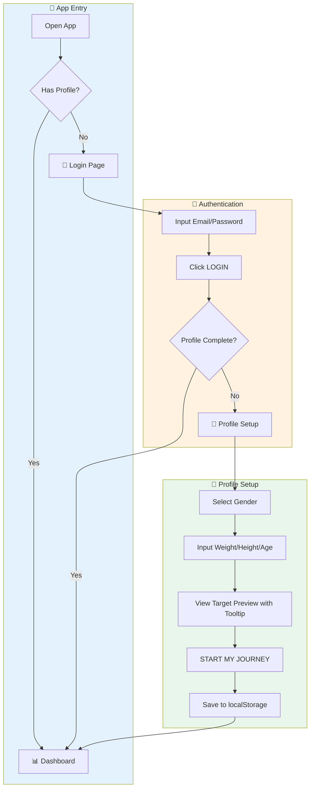
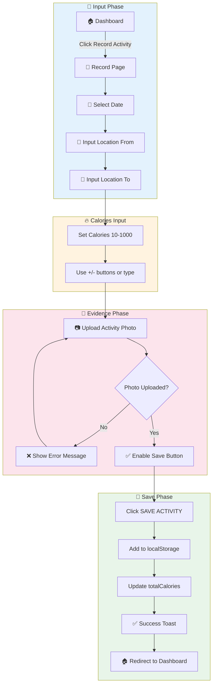
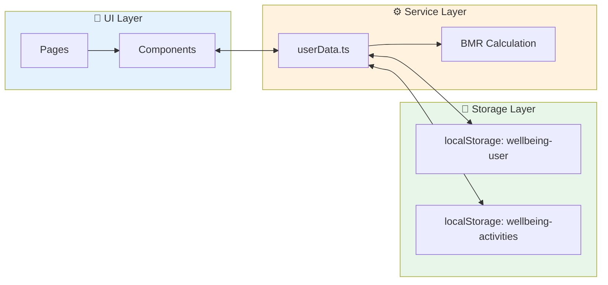
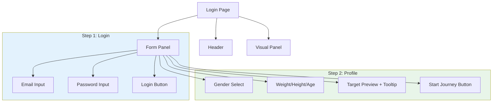
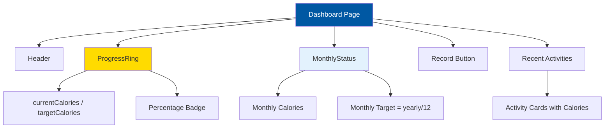
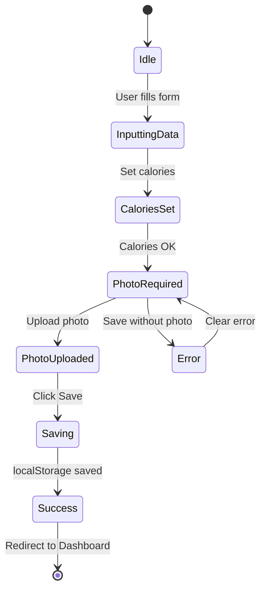
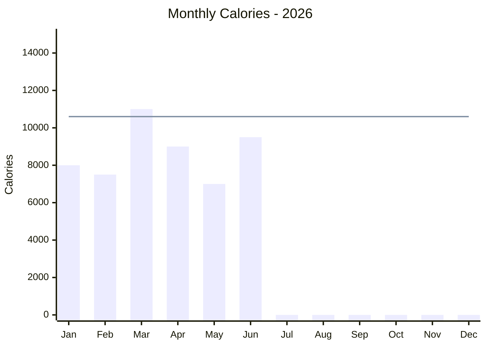
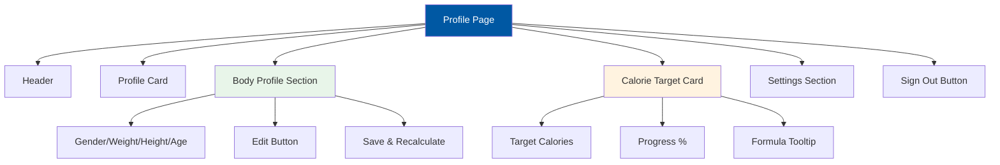
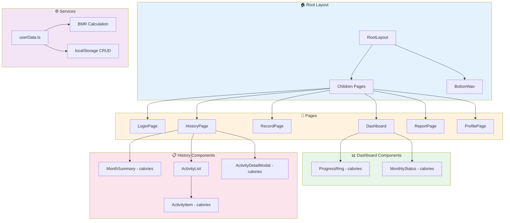
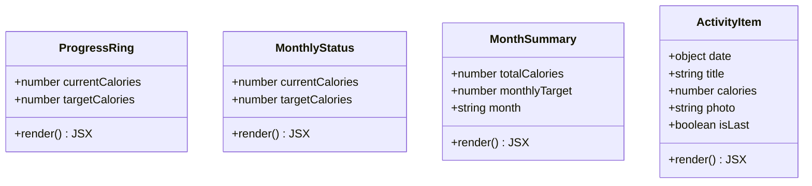

# 📊 ITDigital Wellbeing Monitor v2 - Core Process Documentation

> **Aplikasi Monitoring Aktivitas Jalan Kaki untuk Tim IT & Digital IKEA Indonesia**  
> Target: Kalori Personal (~100K-150K cal/tahun) berdasarkan BMR

---

## 📋 Executive Summary

**ITDigital Wellbeing Monitor v2** adalah aplikasi web mobile-friendly berbasis Next.js 16 yang dirancang untuk membantu tim IT & Digital IKEA Indonesia memantau aktivitas jalan kaki mereka berdasarkan **kalori terbakar**. Target tahunan dihitung secara personal berdasarkan profil fisik masing-masing coworker (weight/height/age/gender).

### Key Features
- 🔐 **Authentication** - Login dengan Coworker ID/Email + Profile Onboarding
- 📊 **Dashboard** - Progress ring kalori tahunan dan status bulanan
- 📝 **Record Activity** - Input lokasi A ke B, kalori manual, upload foto
- 📋 **History** - Riwayat aktivitas dengan filter bulan
- 📈 **Report** - Visualisasi bar chart kalori per bulan
- 👤 **Profile** - Edit profil fisik, recalculate target, statistik personal

---

## 🏗️ Architecture Overview

### Tech Stack

| Teknologi | Versi | Kegunaan |
|-----------|-------|----------|
| Next.js | 16.0.10 | React Framework dengan App Router |
| React | 19.2.1 | UI Library |
| TypeScript | ^5 | Type Safety |
| Tailwind CSS | ^4 | Mobile-first Styling |
| localStorage | - | Data Persistence |
| clsx | ^2.1.1 | Conditional CSS Classes |
| Material Symbols | - | Icon System |

### Project Structure

```
ITDigital-wellbeing/
├── public/                    # Static assets
├── src/
│   ├── app/                   # Next.js App Router pages
│   │   ├── layout.tsx         # Root layout with BottomNav
│   │   ├── page.tsx           # Entry point (redirects to Login)
│   │   ├── globals.css        # Global styles & theme
│   │   ├── login/page.tsx     # Authentication + Profile Onboarding
│   │   ├── dashboard/page.tsx # Main dashboard (calories progress)
│   │   ├── record/page.tsx    # Activity recording (manual calories)
│   │   ├── history/page.tsx   # Activity history (calories view)
│   │   ├── report/page.tsx    # Progress reports (calories charts)
│   │   └── profile/page.tsx   # User profile & body settings
│   ├── components/
│   │   ├── layout/
│   │   │   └── BottomNav.tsx  # Fixed bottom navigation
│   │   ├── dashboard/
│   │   │   ├── ProgressRing.tsx   # Circular calories progress
│   │   │   └── MonthlyStatus.tsx  # Monthly calories goal card
│   │   └── history/
│   │       ├── MonthSummary.tsx       # Month calories summary
│   │       ├── ActivityList.tsx       # Activity list with filter
│   │       ├── ActivityItem.tsx       # Single activity card (calories)
│   │       └── ActivityDetailModal.tsx # Activity detail modal
│   └── lib/
│       └── userData.ts        # Data service (BMR calc, localStorage)
├── package.json
├── tailwind.config.ts
└── next.config.ts
```

---

## 🔄 Core Process Flows

### 1. Onboarding Flow (New User)



### 2. Record Activity Flow



### 3. Data Flow Architecture



---

## 📱 Page-by-Page Analysis

### 1. Login Page (`/login`)

**Purpose:** Autentikasi dan onboarding profil user baru

**Features:**
- Input Coworker ID / Email
- Input Password dengan visibility toggle
- Multi-step form: Login → Profile Setup
- Profile fields: Gender, Weight, Height, Age
- Auto BMR calculation dengan target preview
- Tooltip menjelaskan formula perhitungan
- Social proof (jumlah coworkers yang sudah join)



---

### 2. Dashboard Page (`/dashboard`)

**Purpose:** Tampilan utama setelah login, menampilkan progress kalori

**Features:**
- Greeting personal dengan nama user
- Circular progress ring (currentCalories / targetCalories)
- Monthly status card dengan progress bar kalori
- Quick action button "Record Activity"
- Recent activities list dengan detail kalori

**Components Used:**
- `ProgressRing` - SVG circular progress (calories)
- `MonthlyStatus` - Monthly calorie goal card



---

### 3. Record Activity Page (`/record`)

**Purpose:** Input aktivitas baru dengan kalori manual

**Features:**
- Date picker untuk tanggal aktivitas
- Location From (text input)
- Location To (text input)
- Calories input dengan +/- buttons (10-1000 range)
- Photo upload (mandatory) dengan preview
- Save ke localStorage

**State Management:**
- `date` - Selected date
- `locationFrom`, `locationTo` - Location texts
- `calories` - Manual calories input (number)
- `photo` - Uploaded photo (base64)
- `status` - 'idle' | 'saving' | 'success'



---

### 4. History Page (`/history`)

**Purpose:** Menampilkan riwayat semua aktivitas yang tercatat

**Features:**
- Month filter dropdown (2026)
- Total calories summary card
- Activity list dengan scroll
- Click activity untuk detail modal (calories view)
- Loading state saat switch bulan

**Components Used:**
- `MonthSummary` - Total calories summary
- `ActivityList` - List container dengan filter
- `ActivityDetailModal` - Slide-up modal (calories display)

**Data Structure:**
```typescript
interface Activity {
    date: { day: number; month: string };
    title: string;
    calories: number;
    photo?: string;
    startPoint: string;
    endPoint: string;
}
```

---

### 5. Report Page (`/report`)

**Purpose:** Visualisasi data progress kalori dalam bentuk chart

**Features:**
- Year selector dropdown (2026, 2025)
- Yearly goal progress bar dengan percentage
- Monthly calories bar chart (Jan-Dec)
- Statistics grid (Avg/Month, Best Month)
- Remaining calories to goal dengan CTA

**Chart Types:**
1. **Linear Progress Bar** - Yearly completion percentage
2. **Bar Chart** - Monthly calories (dynamic from localStorage)



---

### 6. Profile Page (`/profile`)

**Purpose:** Informasi user, edit profil fisik, dan pengaturan

**Features:**
- Profile card dengan avatar, nama, dan badges
- Body Profile section (editable)
  - Gender, Weight, Height, Age
  - Save & Recalculate button
- Calorie Target display dengan tooltip formula
- Progress percentage
- Settings toggles (Notifications, Email Digest)
- Navigation links (Help & Support, Privacy & Data)
- Sign Out button (clears localStorage)



---

## 🧩 Component Architecture

### Component Hierarchy



### Component Props Interface



---

## 📊 KPI & Metrics

### BMR Calculation (Mifflin-St Jeor)

| Gender | Formula | Example (70kg, 170cm, 30y) |
|--------|---------|---------------------------|
| **Male** | 10×weight + 6.25×height - 5×age + 5 | 1,717.5 cal/day |
| **Female** | 10×weight + 6.25×height - 5×age - 161 | 1,330.25 cal/day |

### Target Calculation

| Metric | Formula | Example |
|--------|---------|---------|
| **Yearly Target** | BMR × 1.55 × 0.2 × 250 | ~133,000 cal |
| **Monthly Target** | Yearly / 12 | ~11,000 cal |
| **Progress %** | (totalCalories / targetCalories) × 100 | 45% |
| **Remaining** | targetCalories - totalCalories | 70,000 cal |

### Formula Explanation (Tooltip)
```
Target kalori dihitung berdasarkan:
• BMR (Basal Metabolic Rate) - kalori dasar tubuh
• × 1.55 (Activity Factor untuk aktivitas sedang)
• × 0.2 (Porsi kalori dari walking activity)
• × 250 (Hari kerja per tahun)
```

---

## 💾 Data Structure

### User Object (localStorage: wellbeing-user)
```typescript
interface User {
  id: string;
  email: string;
  name: string;
  weight: number;      // kg
  height: number;      // cm
  age: number;
  gender: 'male' | 'female';
  targetCalories: number;
  totalCalories: number;
  profileCompleted: boolean;
}
```

### Activity Object (localStorage: wellbeing-activities)
```typescript
interface Activity {
  id: string;
  date: string;        // ISO date (YYYY-MM-DD)
  locationFrom: string;
  locationTo: string;
  calories: number;    // 10-1000 range
  photo: string;       // base64
  createdAt: string;   // ISO datetime
}
```

---

## 🎨 Design System

### Color Palette

| Variable | Hex Code | Usage |
|----------|----------|-------|
| `--color-primary` | #0058a3 | IKEA Blue - Primary actions, headers |
| `--color-accent` | #ffdb00 | IKEA Yellow - Highlights, badges |
| `--color-background-light` | #f5f5f5 | Page background |
| `--color-card-bg` | #ffffff | Card backgrounds |
| `--color-text-dark` | #111111 | Primary text |
| `--color-text-muted` | #666666 | Secondary text |
| `--color-border-light` | #e5e5e5 | Card borders |

### Typography

| Font | Variable | Usage |
|------|----------|-------|
| Spline Sans | `--font-display` | Headers, bold text |
| Noto Sans | `--font-body` | Body text |
| Material Symbols | - | Icons throughout app |

---

## 📝 Summary

**ITDigital Wellbeing Monitor v2** telah diupgrade dengan:

✅ **Personal Calorie Target** - BMR-based target untuk setiap coworker  
✅ **Onboarding Flow** - Profile setup dengan gender/weight/height/age  
✅ **Manual Calories Input** - 10-1000 cal per aktivitas  
✅ **localStorage Persistence** - Data tersimpan dengan baik  
✅ **Formula Tooltip** - Penjelasan cara perhitungan target  
✅ **Editable Profile** - Update profil dan recalculate target  
✅ **Year 2026** - Semua tanggal diupdate  

---

*Documentation generated on: January 19, 2026*
