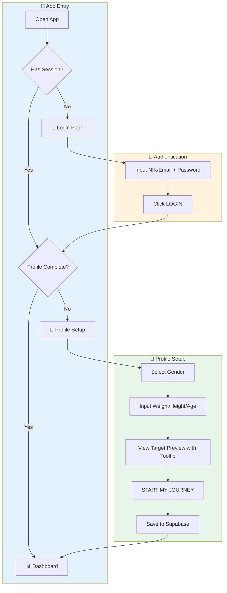
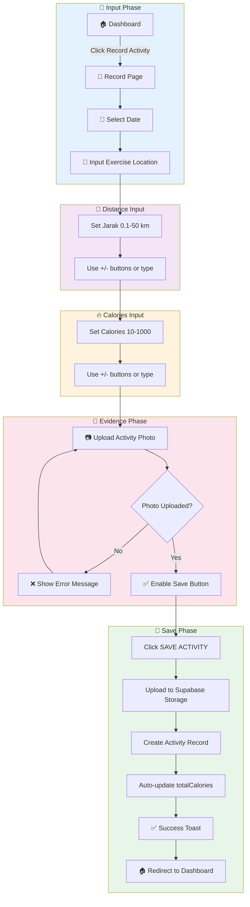
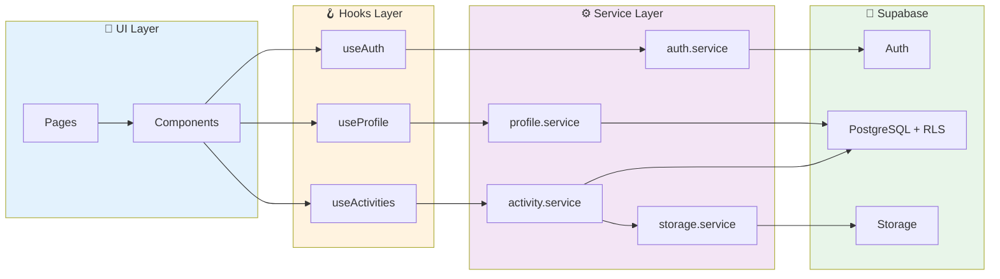
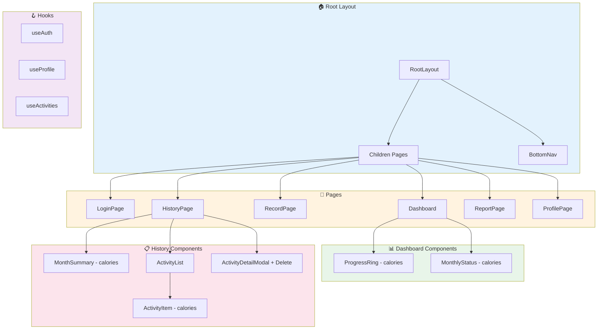

# 📊 ITDigital Wellbeing Monitor v2 - Core Process Documentation

> **Aplikasi Monitoring Aktivitas Jalan Kaki untuk Tim IT & Digital IKEA Indonesia**  
> Target: Kalori Personal (~100K-150K cal/tahun) berdasarkan BMR

---

## 📋 Executive Summary

**ITDigital Wellbeing Monitor v2** adalah aplikasi web mobile-friendly berbasis Next.js 16 yang dirancang untuk membantu tim IT & Digital IKEA Indonesia memantau aktivitas jalan kaki mereka berdasarkan **kalori terbakar**. Target tahunan dihitung secara personal berdasarkan profil fisik masing-masing coworker (weight/height/age/gender).

### Key Features
- 🔐 **Authentication** - Login dengan NIK/Email + Password via Supabase Auth
- 📊 **Dashboard** - Progress ring kalori tahunan dan status bulanan
- 📝 **Record Activity** - Input lokasi, jarak (km), kalori manual, upload foto
- 📋 **History** - Riwayat aktivitas dengan filter 12 bulan + hapus aktivitas
- 📈 **Report** - Visualisasi bar chart kalori per bulan
- 👤 **Profile** - Edit profil fisik, avatar upload, recalculate target

---

## 🏗️ Architecture Overview

### Tech Stack

| Teknologi | Versi | Kegunaan |
|-----------|-------|----------|
| Next.js | 16.0.10 | React Framework dengan App Router |
| React | 19.2.1 | UI Library |
| TypeScript | ^5 | Type Safety |
| Tailwind CSS | ^4 | Mobile-first Styling |
| Supabase | - | Backend (Auth, PostgreSQL, Storage) |
| @supabase/ssr | - | SSR Cookie-based Auth |
| clsx | ^2.1.1 | Conditional CSS Classes |
| Material Symbols | - | Icon System |

### Project Structure

```
ITDigital-wellbeing/
├── public/                    # Static assets
├── src/
│   ├── app/                   # Next.js App Router pages
│   │   ├── layout.tsx         # Root layout with BottomNav
│   │   ├── page.tsx           # Entry point (redirects)
│   │   ├── globals.css        # Global styles & theme
│   │   ├── auth/callback/     # OAuth callback route
│   │   ├── login/page.tsx     # Auth + Profile Onboarding
│   │   ├── dashboard/page.tsx # Main dashboard
│   │   ├── record/page.tsx    # Activity recording
│   │   ├── history/page.tsx   # Activity history + delete
│   │   ├── report/page.tsx    # Progress reports
│   │   └── profile/page.tsx   # User profile + avatar
│   ├── components/
│   │   ├── layout/BottomNav.tsx
│   │   ├── dashboard/
│   │   ├── history/
│   │   └── ui/Logo.tsx
│   ├── lib/
│   │   ├── supabase/          # Supabase clients
│   │   ├── hooks/             # useAuth, useProfile, useActivities
│   │   ├── services/          # auth, profile, activity, storage
│   │   └── userData.ts        # BMR calculations
│   └── middleware.ts          # Auth middleware
├── package.json
├── tailwind.config.ts
└── next.config.ts
```

---

## 🔄 Core Process Flows

### 1. Onboarding Flow (New User)



### 2. Record Activity Flow



### 3. Data Flow Architecture



---

## 📱 Page-by-Page Analysis

### 1. Login Page (`/login`)

**Purpose:** Autentikasi dan onboarding profil user baru

**Features:**
- Input NIK (Nomor Induk Karyawan) atau Email
- Input Password dengan visibility toggle
- Password reset untuk first-time login
- Multi-step form: Login → Profile Setup
- Profile fields: Gender, Weight, Height, Age
- Auto BMR calculation dengan target preview
- Tooltip menjelaskan formula perhitungan
- Social proof (jumlah coworkers yang sudah join)

---

### 2. Dashboard Page (`/dashboard`)

**Purpose:** Tampilan utama setelah login, menampilkan progress kalori

**Features:**
- Greeting personal dengan nama user
- Circular progress ring (currentCalories / targetCalories)
- Monthly status card dengan progress bar kalori
- Quick action button "Record Activity"
- Recent activities list dengan detail kalori

**Components Used:**
- `ProgressRing` - SVG circular progress (calories)
- `MonthlyStatus` - Monthly calorie goal card

---

### 3. Record Activity Page (`/record`)

**Purpose:** Input aktivitas baru dengan kalori manual

**Features:**
- Date picker untuk tanggal aktivitas
- Exercise Location (text input - single field)
- Jarak/Distance input dengan +/- buttons (0.1-50 km range)
- Calories input dengan +/- buttons atau manual input (10-1000 range)
- Photo upload (mandatory) dengan preview
- Save ke Supabase database + Storage

---

### 4. History Page (`/history`)

**Purpose:** Menampilkan riwayat semua aktivitas yang tercatat

**Features:**
- Month filter dropdown (semua 12 bulan)
- Total calories summary card
- Activity list dengan scroll
- Click activity untuk detail modal
- **Delete activity** dengan confirmation
- Loading state saat switch bulan

**Components Used:**
- `MonthSummary` - Total calories summary
- `ActivityList` - List container dengan filter
- `ActivityDetailModal` - Slide-up modal + delete

---

### 5. Report Page (`/report`)

**Purpose:** Visualisasi data progress kalori dalam bentuk chart

**Features:**
- Year selector dropdown (2026, 2025)
- Yearly goal progress bar dengan percentage
- Monthly calories bar chart (Jan-Dec)
- Statistics grid (Avg/Month, Best Month)
- Remaining calories to goal dengan CTA

---

### 6. Profile Page (`/profile`)

**Purpose:** Informasi user, edit profil fisik, dan pengaturan

**Features:**
- Profile card dengan avatar upload, nama, dan badges
- Body Profile section (editable)
  - Gender, Weight, Height, Age
  - Save & Recalculate button
- Calorie Target display dengan tooltip formula
- Progress percentage
- Settings toggles (Notifications, Email Digest)
- Navigation links (Help & Support, Privacy & Data)
- Sign Out button (clears session)

---

## 🧩 Component Architecture

### Component Hierarchy



---

## 📊 KPI & Metrics

### BMR Calculation (Mifflin-St Jeor)

| Gender | Formula | Example (70kg, 170cm, 30y) |
|--------|---------|---------------------------|
| **Male** | 10×weight + 6.25×height - 5×age + 5 | 1,717.5 cal/day |
| **Female** | 10×weight + 6.25×height - 5×age - 161 | 1,330.25 cal/day |

### Target Calculation

| Metric | Formula | Example (BMR = 1,717 cal/day) |
|--------|---------|-------------------------------|
| **Weekly Target** | BMR × 15% | ~258 cal |
| **Yearly Target** | Weekly × 52 | ~13,400 cal |
| **Monthly Target** | Yearly / 12 | ~1,116 cal |
| **Progress %** | (totalCalories / targetCalories) × 100 | 45% |
| **Remaining** | targetCalories - totalCalories | 7,000 cal |

---

## 💾 Data Structure (Supabase)

### User Profile
```typescript
interface UserProfile {
  id: string;
  user_id: string;
  nik: string | null;
  name: string;
  weight: number;      // kg
  height: number;      // cm
  age: number;
  gender: 'male' | 'female';
  target_calories: number;
  total_calories: number;
  avatar_url: string | null;
  profile_completed: boolean;
  created_at: string;
  updated_at: string;
}
```

### Activity
```typescript
interface Activity {
  id: string;
  user_id: string;
  activity_date: string;  // YYYY-MM-DD
  location: string;
  distance: number;       // km
  calories: number;
  photo_url: string | null;
  created_at: string;
}
```

---

## 🎨 Design System

### Color Palette

| Variable | Hex Code | Usage |
|----------|----------|-------|
| `--color-primary` | #0058a3 | IKEA Blue - Primary actions, headers |
| `--color-accent` | #ffdb00 | IKEA Yellow - Highlights, badges |
| `--color-background-light` | #f5f5f5 | Page background |
| `--color-card-bg` | #ffffff | Card backgrounds |
| `--color-text-dark` | #111111 | Primary text |
| `--color-text-muted` | #666666 | Secondary text |
| `--color-border-light` | #e5e5e5 | Card borders |

### Typography

| Font | Variable | Usage |
|------|----------|-------|
| Spline Sans | `--font-display` | Headers, bold text |
| Noto Sans | `--font-body` | Body text |
| Material Symbols | - | Icons throughout app |

---

## 📝 Summary

**ITDigital Wellbeing Monitor v2** telah diupgrade dengan:

✅ **Supabase Backend** - Full cloud integration (Auth, DB, Storage)  
✅ **Personal Calorie Target** - BMR-based target untuk setiap coworker  
✅ **NIK/Email Login** - Flexible authentication dengan Supabase Auth  
✅ **Onboarding Flow** - Profile setup dengan gender/weight/height/age  
✅ **Manual Calories Input** - 10-1000 cal per aktivitas  
✅ **Delete Activity** - Hapus aktivitas dari history page  
✅ **Avatar Upload** - Upload foto profil ke Supabase Storage  
✅ **12-Month Filter** - Filter aktivitas untuk semua bulan  
✅ **Formula Tooltip** - Penjelasan cara perhitungan target  
✅ **Editable Profile** - Update profil dan recalculate target  
✅ **Year 2026** - Semua tanggal diupdate  
✅ **Vercel Deployment** - SSR dengan optimized performance  

---

*Documentation updated on: January 20, 2026*
