# 📊 ITDigital Wellbeing Monitor - Project Analysis & Documentation

> **Aplikasi Monitoring Aktivitas Jalan Kaki untuk Tim IT & Digital IKEA Indonesia**  
> Target: 150 km/tahun | Target Bulanan: 12.5 km/bulan

---

## 📋 Executive Summary

**ITDigital Wellbeing Monitor** adalah aplikasi web mobile-friendly berbasis Next.js 16 yang dirancang untuk membantu tim IT & Digital IKEA Indonesia memantau dan mencatat aktivitas jalan kaki mereka. Aplikasi ini memiliki target tahunan sebesar **150 km** yang dibagi menjadi target bulanan **12.5 km**.

### Key Features
- 🔐 **Authentication** - Login dengan Coworker ID/Email
- 📊 **Dashboard** - Progress ring tahunan dan status bulanan
- 📝 **Record Activity** - Input lokasi A ke B dengan upload foto
- 📋 **History** - Riwayat aktivitas dengan filter bulan
- 📈 **Report** - Visualisasi bar chart dan line chart
- 👤 **Profile** - Statistik personal dan pengaturan

---

## 🏗️ Architecture Overview

### Tech Stack

| Teknologi | Versi | Kegunaan |
|-----------|-------|----------|
| Next.js | 16.0.10 | React Framework dengan App Router |
| React | 19.2.1 | UI Library |
| TypeScript | ^5 | Type Safety |
| Tailwind CSS | ^4 | Mobile-first Styling |
| clsx | ^2.1.1 | Conditional CSS Classes |
| Material Symbols | - | Icon System |

### Project Structure

```
ITDigital-wellbeing/
├── public/                    # Static assets
├── src/
│   ├── app/                   # Next.js App Router pages
│   │   ├── layout.tsx         # Root layout with BottomNav
│   │   ├── page.tsx           # Entry point (redirects to Login)
│   │   ├── globals.css        # Global styles & theme
│   │   ├── login/page.tsx     # Authentication page
│   │   ├── dashboard/page.tsx # Main dashboard
│   │   ├── record/page.tsx    # Activity recording
│   │   ├── history/page.tsx   # Activity history
│   │   ├── report/page.tsx    # Progress reports
│   │   └── profile/page.tsx   # User profile & settings
│   └── components/
│       ├── layout/
│       │   └── BottomNav.tsx  # Fixed bottom navigation
│       ├── dashboard/
│       │   ├── ProgressRing.tsx   # Circular progress
│       │   └── MonthlyStatus.tsx  # Monthly goal card
│       └── history/
│           ├── MonthSummary.tsx       # Month distance summary
│           ├── ActivityList.tsx       # Activity list with filter
│           ├── ActivityItem.tsx       # Single activity card
│           └── ActivityDetailModal.tsx # Activity detail modal
├── package.json
├── tailwind.config.ts
└── next.config.ts
```

---

## 🔄 Core Process Flows

### 1. Application Navigation Flow

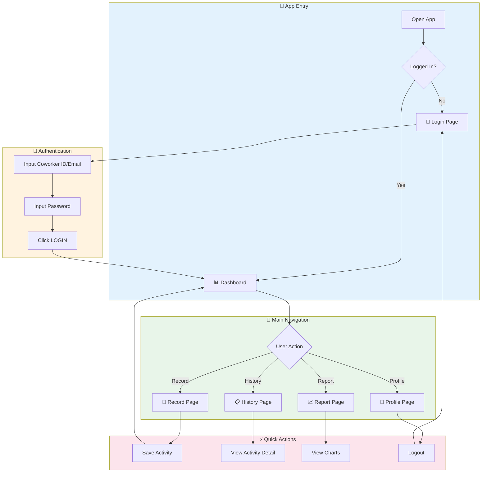

### 2. Activity Recording Process

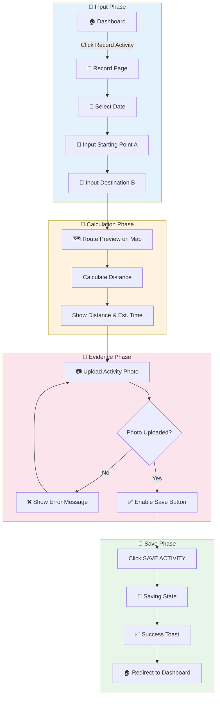

### 3. Data Flow Architecture

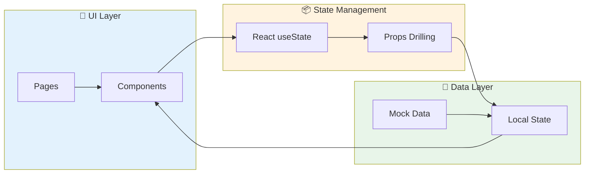

---

## 📱 Page-by-Page Analysis

### 1. Login Page (`/login`)

**Purpose:** Autentikasi pengguna dengan identitas IKEA

**Features:**
- Input Coworker ID / Email
- Input Password dengan visibility toggle
- "Forgot Password" link
- Terms of Service & Privacy Policy links
- Social proof (jumlah coworkers yang sudah join)

**UI Components:**
- Header dengan branding IKEA
- Split layout (Visual + Form) untuk desktop
- Responsive mobile-first design

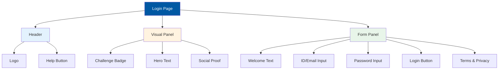

---

### 2. Dashboard Page (`/dashboard`)

**Purpose:** Tampilan utama setelah login, menampilkan progress overview

**Features:**
- Greeting personal dengan nama user
- Circular progress ring (yearly: X/150km)
- Monthly status card dengan progress bar
- Quick action button "Record Activity"
- Recent walks list dengan detail singkat

**Components Used:**
- `ProgressRing` - SVG circular progress
- `MonthlyStatus` - Monthly goal card

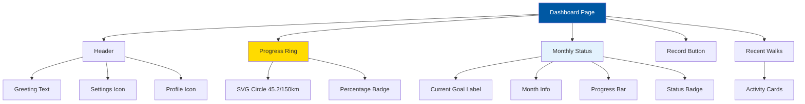

---

### 3. Record Activity Page (`/record`)

**Purpose:** Input aktivitas jalan kaki baru dengan lokasi A ke B

**Features:**
- Date picker untuk tanggal aktivitas
- Location input A (Starting Point)
- Location input B (Destination)
- Map preview dengan route visualization
- Distance & estimated time calculation
- Photo upload (mandatory) dengan preview
- Save button dengan loading & success states

**State Management:**
- `date` - Selected date
- `photo` - Uploaded photo (base64)
- `status` - 'idle' | 'saving' | 'success'
- `error` - Photo validation error
- `shake` - Animation state for error

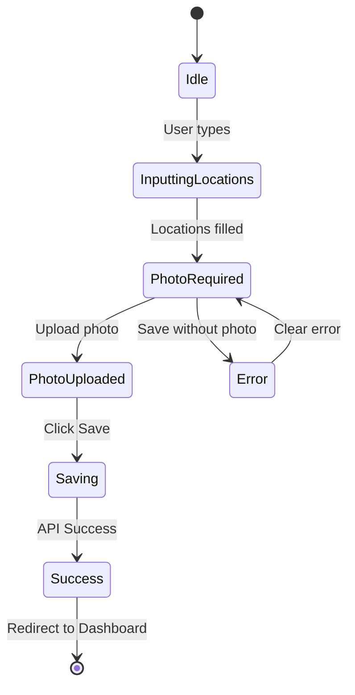

---

### 4. History Page (`/history`)

**Purpose:** Menampilkan riwayat semua aktivitas yang tercatat

**Features:**
- Month filter dropdown
- Total distance summary card
- Activity list dengan scroll
- Click activity untuk detail modal
- Loading state saat switch bulan

**Components Used:**
- `MonthSummary` - Total km summary
- `ActivityList` - List container dengan filter
- `ActivityDetailModal` - Slide-up modal

**Data Structure:**
```typescript
interface Activity {
    date: { day: number; month: string };
    title: string;
    duration: string;
    distance: string;
    startPoint: string;
    endPoint: string;
}
```

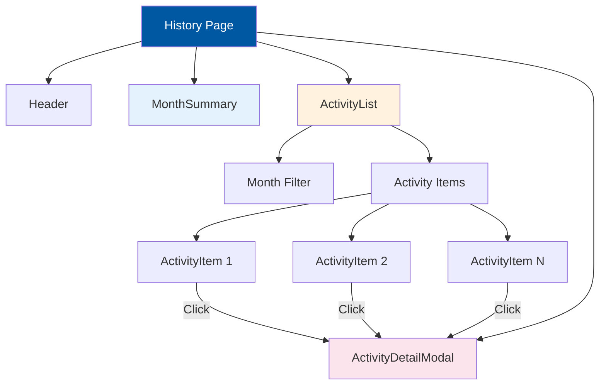

---

### 5. Report Page (`/report`)

**Purpose:** Visualisasi data progress dalam bentuk chart

**Features:**
- Year selector dropdown (2024, 2023)
- Yearly goal progress bar dengan percentage
- Monthly distance bar chart (Jan-Dec)
- Cumulative line chart vs target pace
- Statistics grid (Avg/Month, Best Month)
- Remaining km to goal dengan CTA

**Chart Types:**
1. **Linear Progress Bar** - Yearly completion
2. **Bar Chart** - Monthly distance
3. **Line Chart** - Cumulative progress vs target

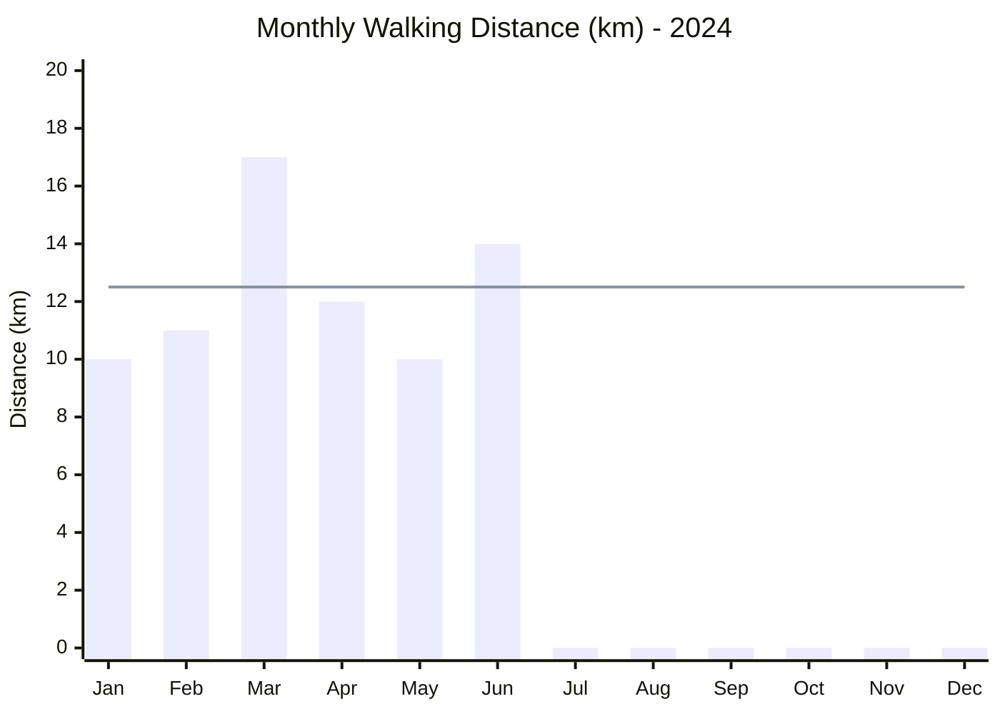

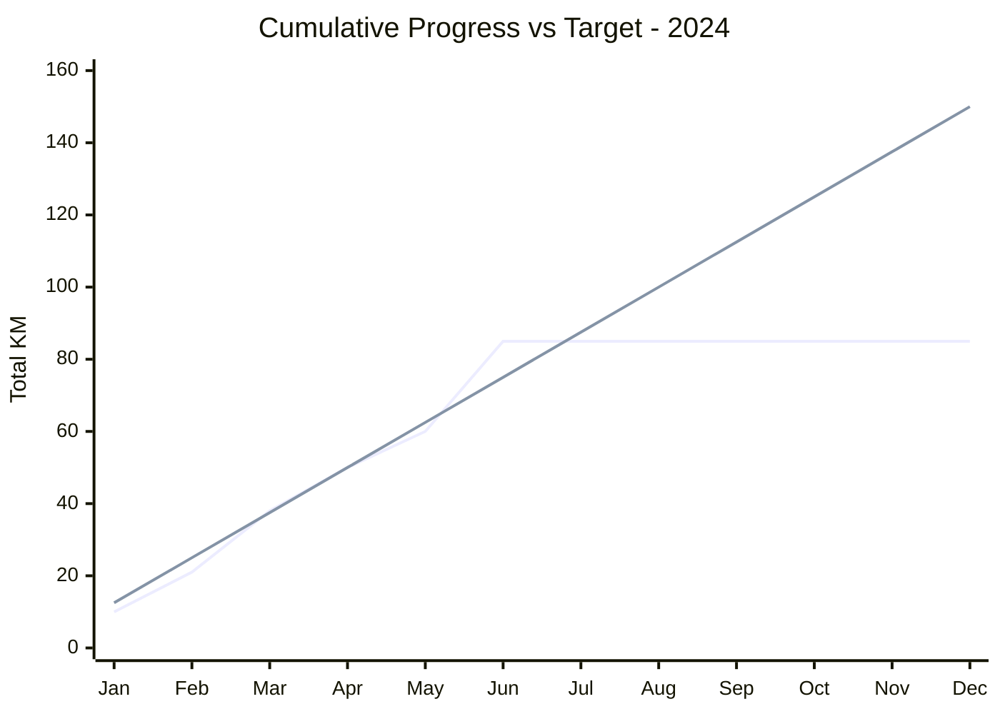

---

### 6. Profile Page (`/profile`)

**Purpose:** Informasi user, statistik personal, dan pengaturan

**Features:**
- Profile card dengan avatar, nama, dan badges
- Personal statistics (Total KM, Goal Progress, Global Rank)
- Settings toggles (Notifications, Email Digest)
- Navigation links (Help & Support, Privacy & Data)
- Sign Out button

**State Management:**
- `notificationsEnabled` - Notification toggle
- `emailDigestEnabled` - Email digest toggle

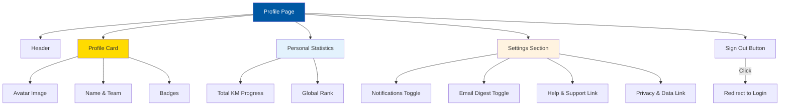

---

## 🧩 Component Architecture

### Component Hierarchy

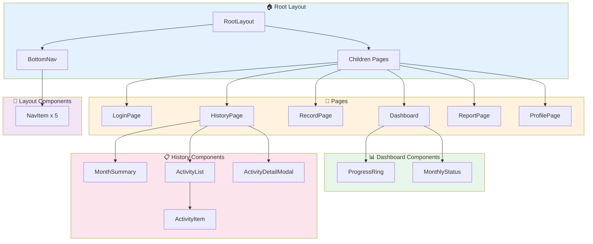

### Component Props Interface

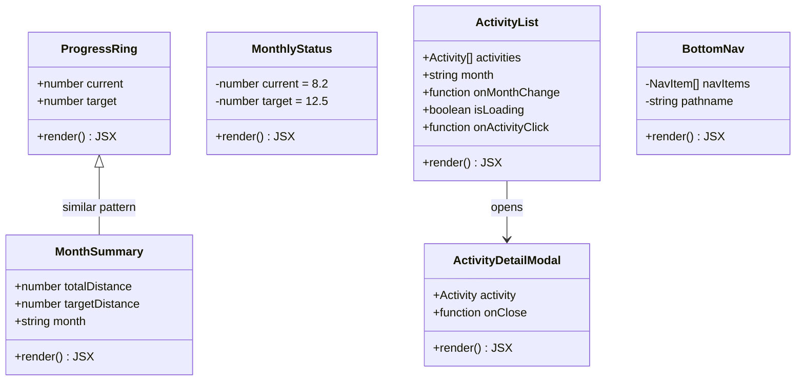

---

## 🎨 Design System

### Color Palette

| Variable | Hex Code | Usage |
|----------|----------|-------|
| `--color-primary` | #0058a3 | IKEA Blue - Primary actions, headers |
| `--color-accent` | #ffdb00 | IKEA Yellow - Highlights, badges |
| `--color-background-light` | #f5f5f5 | Page background |
| `--color-card-bg` | #ffffff | Card backgrounds |
| `--color-text-dark` | #111111 | Primary text |
| `--color-text-muted` | #666666 | Secondary text |
| `--color-border-light` | #e5e5e5 | Card borders |

### Typography

| Font | Variable | Usage |
|------|----------|-------|
| Spline Sans | `--font-display` | Headers, bold text |
| Noto Sans | `--font-body` | Body text |
| Material Symbols | - | Icons throughout app |

### Spacing & Layout

- **Max Width:** 512px (mobile container)
- **Bottom Nav Height:** 64px with padding
- **Page Padding:** 24px horizontal
- **Card Radius:** 24px (rounded-3xl)
- **Button Radius:** Full (rounded-full)

---

## 📊 KPI & Metrics

### Target Calculations

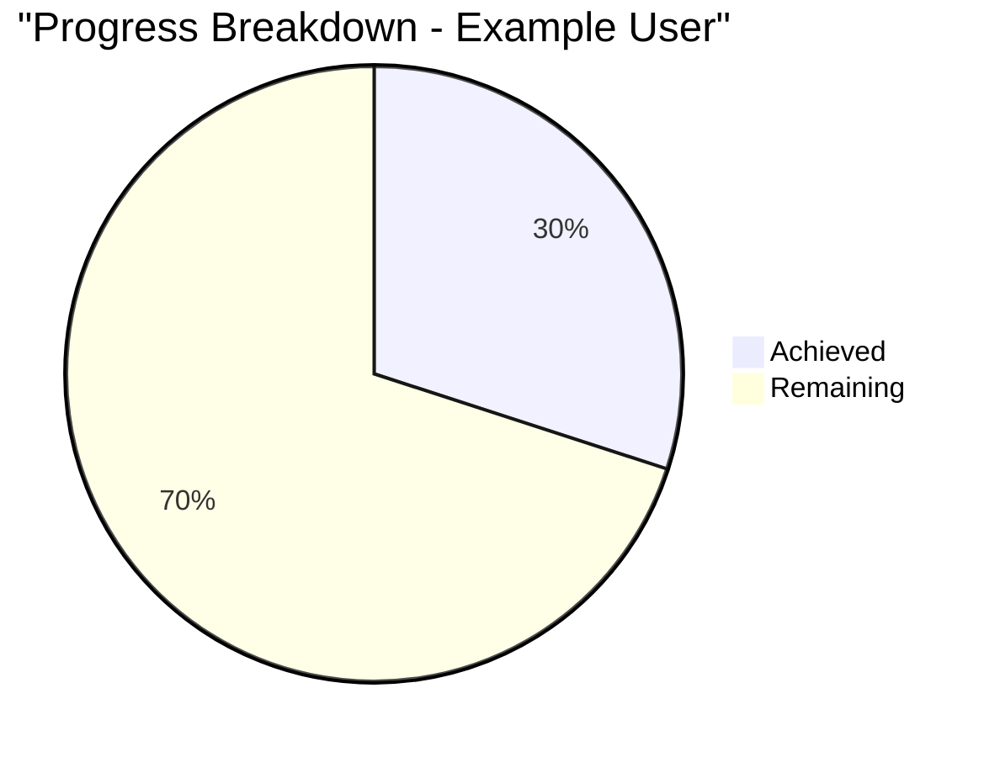

| Metric | Formula | Example |
|--------|---------|---------|
| **Yearly Target** | Fixed | 150 km |
| **Monthly Target** | 150 / 12 | 12.5 km |
| **Progress %** | (current / target) × 100 | (45.2 / 150) × 100 = 30% |
| **Remaining** | target - current | 150 - 45.2 = 104.8 km |

### User Engagement Metrics (Mockup)

| Metric | Value |
|--------|-------|
| Walker Level | Level 5 |
| Global Rank | #12 |
| Rank Change | ↑3 positions |
| Best Month | March 2024 |
| Avg/Month | 12.1 km |

---

## 🔐 Security Considerations

> [!WARNING]
> **Current State:** Aplikasi menggunakan mock data dan tidak memiliki backend/API

### Authentication Flow (Current - Mock)
- Login button langsung redirect ke dashboard
- Tidak ada validasi credentials
- Tidak ada session management

### Recommended Improvements
1. Implement proper authentication (OAuth/JWT)
2. Add protected routes middleware
3. Secure API endpoints
4. Implement rate limiting
5. Add CSRF protection

---

## 🚀 Future Enhancements

### Planned Features (from implementation.md)

1. **Google Maps Integration**
   - Places Autocomplete
   - Route calculation
   - Distance Matrix API

2. **PWA Capabilities**
   - Service Worker
   - Offline support
   - Add to Home Screen

3. **Backend Integration**
   - User database
   - Activity storage
   - Leaderboard API

4. **Advanced Analytics**
   - Weekly/Monthly trends
   - Team statistics
   - Challenge modes

---

## 📝 Summary

**ITDigital Wellbeing Monitor** adalah aplikasi yang well-structured dengan:

✅ **Clean Architecture** - Separation of concerns yang baik antara pages dan components  
✅ **Mobile-First Design** - Responsive dan optimized untuk mobile devices  
✅ **IKEA Branding** - Konsisten dengan design system IKEA (Blue #0058a3, Yellow #FFDB00)  
✅ **Interactive UI** - Animasi, transitions, dan feedback yang smooth  
✅ **Data Visualization** - Progress rings, bar charts, dan line charts  

⚠️ **Limitations** - Masih menggunakan mock data, belum ada backend integration  
⚠️ **No Authentication** - Login flow hanya placeholder  
⚠️ **No Persistence** - Data tidak disimpan antar sesi  

---

*Documentation generated on: January 19, 2026*
