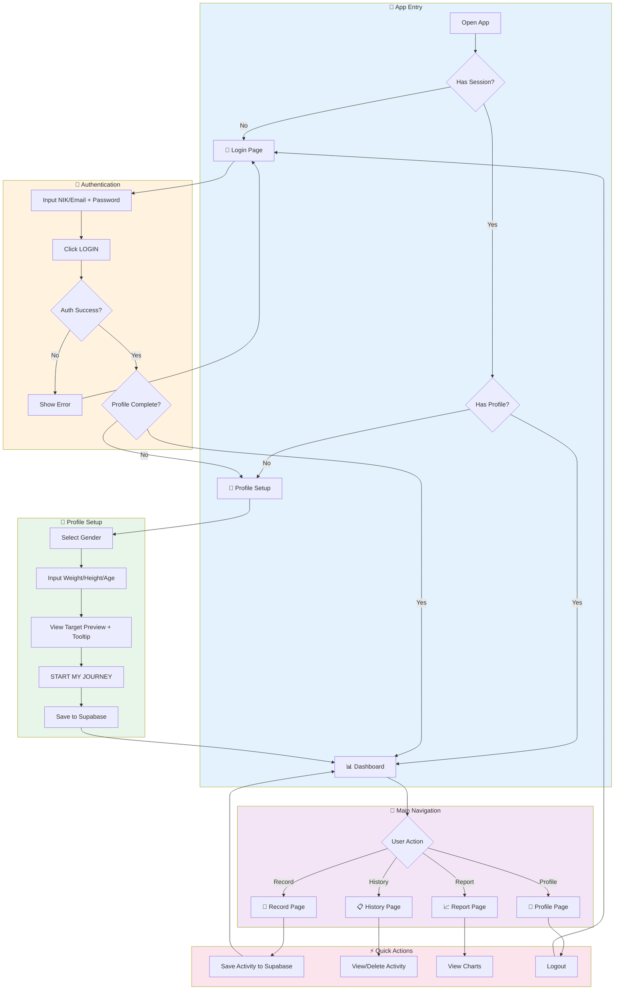
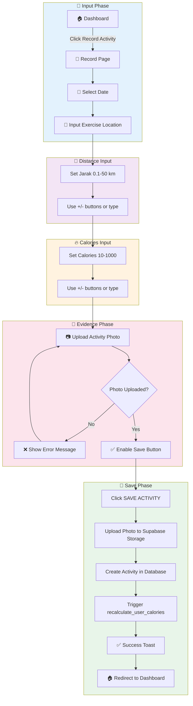
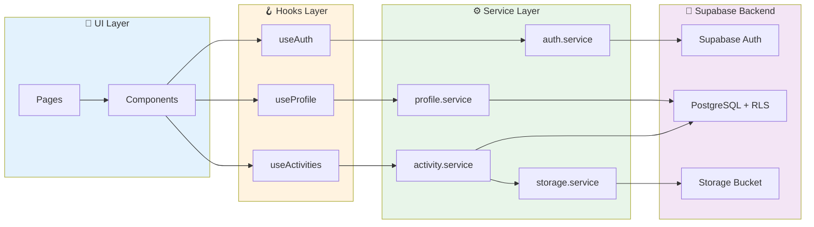
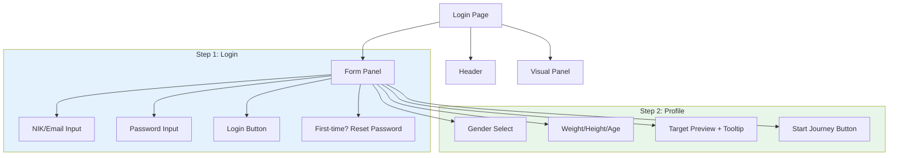

# 📊 ITDigital Wellbeing Monitor - Project Analysis & Documentation

> **Aplikasi Monitoring Aktivitas Jalan Kaki untuk Tim IT & Digital IKEA Indonesia**  
> Target: Personal Calorie Target berdasarkan BMR (~100K-150K cal/tahun)

---

## 📋 Executive Summary

**ITDigital Wellbeing Monitor** adalah aplikasi web mobile-friendly berbasis Next.js 16 yang dirancang untuk membantu tim IT & Digital IKEA Indonesia memantau dan mencatat aktivitas jalan kaki mereka berdasarkan **kalori terbakar**. Target tahunan dihitung secara personal menggunakan **Mifflin-St Jeor BMR formula** berdasarkan profil fisik masing-masing coworker.

### Key Features
- 🔐 **Authentication** - Login dengan NIK/Email + Password via Supabase Auth
- 📊 **Dashboard** - Progress ring kalori tahunan dan status bulanan
- 📝 **Record Activity** - Input lokasi, jarak (km), kalori manual, upload foto
- 📋 **History** - Riwayat aktivitas dengan filter 12 bulan + hapus aktivitas
- 📈 **Report** - Visualisasi bar chart kalori per bulan
- 👤 **Profile** - Edit profil fisik, avatar upload, recalculate target
- 💾 **Backend** - Supabase (PostgreSQL, Storage, Auth)
- 🚀 **Deployment** - Vercel dengan SSR support

---

## 🏗️ Architecture Overview

### Tech Stack

| Teknologi | Versi | Kegunaan |
|-----------|-------|----------|
| Next.js | 16.0.10 | React Framework dengan App Router |
| React | 19.2.1 | UI Library |
| TypeScript | ^5 | Type Safety |
| Tailwind CSS | ^4 | Mobile-first Styling |
| Supabase | - | Backend (Auth, PostgreSQL, Storage) |
| @supabase/ssr | - | SSR Cookie-based Auth |
| clsx | ^2.1.1 | Conditional CSS Classes |
| Material Symbols | - | Icon System |

### Project Structure

```
ITDigital-wellbeing/
├── public/                    # Static assets
├── src/
│   ├── app/                   # Next.js App Router pages
│   │   ├── layout.tsx         # Root layout with BottomNav
│   │   ├── page.tsx           # Entry point (redirects)
│   │   ├── globals.css        # Global styles & theme
│   │   ├── auth/
│   │   │   └── callback/route.ts # OAuth callback handler
│   │   ├── login/page.tsx     # Authentication + Profile Onboarding
│   │   ├── dashboard/page.tsx # Main dashboard (calories progress)
│   │   ├── record/page.tsx    # Activity recording (manual calories)
│   │   ├── history/page.tsx   # Activity history + delete feature
│   │   ├── report/page.tsx    # Progress reports (calories charts)
│   │   └── profile/page.tsx   # User profile + avatar upload
│   ├── components/
│   │   ├── layout/
│   │   │   └── BottomNav.tsx  # Fixed bottom navigation
│   │   ├── dashboard/
│   │   │   ├── ProgressRing.tsx   # Circular calories progress
│   │   │   └── MonthlyStatus.tsx  # Monthly calorie goal card
│   │   ├── history/
│   │   │   ├── MonthSummary.tsx       # Month calories summary
│   │   │   ├── ActivityList.tsx       # Activity list with filter
│   │   │   ├── ActivityItem.tsx       # Single activity card
│   │   │   └── ActivityDetailModal.tsx # Detail modal + delete
│   │   └── ui/
│   │       └── Logo.tsx       # Reusable logo component
│   ├── lib/
│   │   ├── supabase/          # Supabase client utilities
│   │   │   ├── client.ts      # Browser client
│   │   │   ├── server.ts      # Server client
│   │   │   ├── middleware.ts  # Middleware client
│   │   │   └── types.ts       # Database types
│   │   ├── hooks/             # Custom React hooks
│   │   │   ├── index.ts       # Export all hooks
│   │   │   ├── useAuth.ts     # Authentication state
│   │   │   ├── useProfile.ts  # User profile state
│   │   │   └── useActivities.ts # Activities CRUD & filtering
│   │   ├── services/          # API service layer
│   │   │   ├── index.ts       # Export all services
│   │   │   ├── auth.service.ts    # Auth operations
│   │   │   ├── profile.service.ts # Profile CRUD
│   │   │   ├── activity.service.ts # Activity CRUD
│   │   │   └── storage.service.ts  # Photo upload/delete
│   │   └── userData.ts        # BMR calculations & utilities
│   └── middleware.ts          # Auth middleware (route protection)
├── docs/
│   ├── project_analysis.md    # This file
│   ├── core_process.md        # Core process documentation
│   └── Backend Plan Implementation.md
├── vercel.json                # Vercel deployment config
├── package.json
├── tailwind.config.ts
└── next.config.ts
```

---

## 🔄 Core Process Flows

### 1. Application Navigation Flow



### 2. Activity Recording Process



### 3. Data Flow Architecture



---

## 📱 Page-by-Page Analysis

### 1. Login Page (`/login`)

**Purpose:** Autentikasi dan onboarding profil user baru

**Features:**
- Input NIK (Nomor Induk Karyawan) atau Email
- Input Password dengan visibility toggle
- Password reset flow untuk first-time login
- Multi-step form: Login → Profile Setup
- Profile fields: Gender, Weight, Height, Age
- Auto BMR calculation dengan target preview
- Tooltip menjelaskan formula perhitungan
- Motivational message dengan walking time estimate

**Authentication Flow:**
- NIK detection (numeric = NIK, contains @ = email)
- Lookup email by NIK from user_profiles table
- Supabase Auth signInWithPassword
- Session cookie management



---

### 2. Dashboard Page (`/dashboard`)

**Purpose:** Tampilan utama setelah login, menampilkan progress kalori

**Features:**
- Greeting personal dengan nama user
- Circular progress ring (currentCalories / targetCalories)
- Monthly status card dengan progress bar kalori
- Quick action button "Record Activity"
- Recent activities list dengan detail kalori

**Data Flow:**
- `useAuth` - get current user session
- `useProfile` - get user profile & targets
- `useActivities` - get activities & monthly stats

---

### 3. Record Activity Page (`/record`)

**Purpose:** Input aktivitas baru dengan kalori manual

**Features:**
- Date picker untuk tanggal aktivitas
- Exercise Location (text input - single field)
- Jarak/Distance input dengan +/- buttons (0.1-50 km range)
- Calories input dengan +/- buttons/manual input (10-1000 range)
- Photo upload (mandatory) dengan preview
- Upload to Supabase Storage
- Save to activities table

**State Management:**
- `date` - Selected date
- `location` - Exercise location text
- `distance` - Distance in km (number)
- `calories` - Manual calories input (number)
- `photo` - Photo preview URL
- `isUploading` - Upload state

---

### 4. History Page (`/history`)

**Purpose:** Menampilkan riwayat semua aktivitas yang tercatat

**Features:**
- Month filter dropdown (all 12 months)
- Total calories summary card
- Activity list dengan scroll
- Click activity untuk detail modal
- **Delete activity** dengan confirmation
- Loading state saat switch bulan

**Components Used:**
- `MonthSummary` - Total calories summary
- `ActivityList` - List container dengan filter
- `ActivityDetailModal` - Slide-up modal + delete button

---

### 5. Report Page (`/report`)

**Purpose:** Visualisasi data progress kalori dalam bentuk chart

**Features:**
- Year selector dropdown (2026, 2025)
- Yearly goal progress bar dengan percentage
- Monthly calories bar chart (Jan-Dec)
- Statistics grid (Avg/Month, Best Month)
- Remaining calories to goal dengan CTA

---

### 6. Profile Page (`/profile`)

**Purpose:** Informasi user, edit profil fisik, dan pengaturan

**Features:**
- Profile card dengan avatar upload, nama, dan badges
- Body Profile section (editable)
  - Gender, Weight, Height, Age
  - Save & Recalculate button
- Calorie Target display dengan tooltip formula
- Progress percentage
- Settings toggles (Notifications, Email Digest)
- Sign Out button (clears session)

---

## 🧩 Component Architecture

### Custom Hooks

| Hook | Purpose | Returns |
|------|---------|---------|
| `useAuth` | Authentication state | `user`, `isLoading`, `signIn`, `signOut` |
| `useProfile` | Profile management | `profile`, `targets`, `updateProfile` |
| `useActivities` | Activities CRUD | `activities`, `addActivity`, `deleteActivity`, `monthlyStats` |

### Services Layer

| Service | Purpose | Methods |
|---------|---------|---------|
| `auth.service` | Authentication | `signIn`, `signOut`, `lookupEmailByNIK` |
| `profile.service` | Profile CRUD | `getProfile`, `createProfile`, `updateProfile` |
| `activity.service` | Activities CRUD | `getActivities`, `createActivity`, `deleteActivity` |
| `storage.service` | File uploads | `uploadPhoto`, `deletePhoto`, `getPhotoUrl` |

---

## 📊 KPI & Metrics

### BMR Calculation (Mifflin-St Jeor)

| Gender | Formula | Example (70kg, 170cm, 30y) |
|--------|---------|---------------------------|
| **Male** | 10×weight + 6.25×height - 5×age + 5 | 1,717.5 cal/day |
| **Female** | 10×weight + 6.25×height - 5×age - 161 | 1,330.25 cal/day |

### Target Calculation

| Metric | Formula | Example |
|--------|---------|---------|
| **Weekly Target** | BMR × 15% | ~258 cal |
| **Yearly Target** | Weekly × 52 | ~13,400 cal |
| **Monthly Target** | Yearly / 12 | ~1,116 cal |
| **Progress %** | (totalCalories / targetCalories) × 100 | 45% |

---

## 💾 Data Structure (Supabase)

### User Profiles Table
```sql
CREATE TABLE public.user_profiles (
    id UUID PRIMARY KEY,
    user_id UUID REFERENCES auth.users(id),
    nik TEXT UNIQUE,
    name TEXT NOT NULL,
    weight DECIMAL(5,2) NOT NULL,
    height DECIMAL(5,2) NOT NULL,
    age INTEGER NOT NULL,
    gender TEXT NOT NULL,
    target_calories DECIMAL(10,2) DEFAULT 0,
    total_calories DECIMAL(10,2) DEFAULT 0,
    avatar_url TEXT,
    profile_completed BOOLEAN DEFAULT false,
    created_at TIMESTAMPTZ DEFAULT NOW(),
    updated_at TIMESTAMPTZ DEFAULT NOW()
);
```

### Activities Table
```sql
CREATE TABLE public.activities (
    id UUID PRIMARY KEY,
    user_id UUID REFERENCES auth.users(id),
    activity_date DATE NOT NULL,
    location TEXT NOT NULL,
    distance DECIMAL(6,2) NOT NULL,
    calories DECIMAL(8,2) NOT NULL,
    photo_url TEXT,
    created_at TIMESTAMPTZ DEFAULT NOW()
);
```

---

## 🔐 Security

### Authentication
- Supabase Auth with email/password
- NIK lookup for alternative login
- Session-based with HTTP-only cookies
- Middleware route protection using `getSession()` (optimized)

### Row Level Security (RLS)
- Users can only view/edit their own data
- Policies on `user_profiles` and `activities` tables
- Storage bucket with user-folder structure

---

## 🚀 Deployment

### Current Setup
- **Platform:** Vercel
- **Backend:** Supabase (hosted)
- **Domain:** Configured via Vercel

### Environment Variables
```bash
NEXT_PUBLIC_SUPABASE_URL=https://xxx.supabase.co
NEXT_PUBLIC_SUPABASE_ANON_KEY=eyJxxx...
```

---

## 📝 Summary

**ITDigital Wellbeing Monitor** adalah aplikasi yang fully functional dengan:

✅ **Supabase Backend** - PostgreSQL, Auth, Storage  
✅ **Personal Calorie Target** - BMR-based target untuk setiap coworker  
✅ **NIK/Email Login** - Flexible authentication options  
✅ **Onboarding Flow** - Profile setup dengan gender/weight/height/age  
✅ **Manual Calories Input** - 10-1000 cal per aktivitas  
✅ **Delete Activity** - Hapus aktivitas dari history  
✅ **Avatar Upload** - Upload foto profil  
✅ **12-Month Filter** - Filter aktivitas semua bulan  
✅ **Formula Tooltip** - Penjelasan cara perhitungan target  
✅ **Editable Profile** - Update profil dan recalculate target  
✅ **Vercel Deployment** - SSR dengan optimized performance  

---

*Documentation updated on: January 20, 2026*
